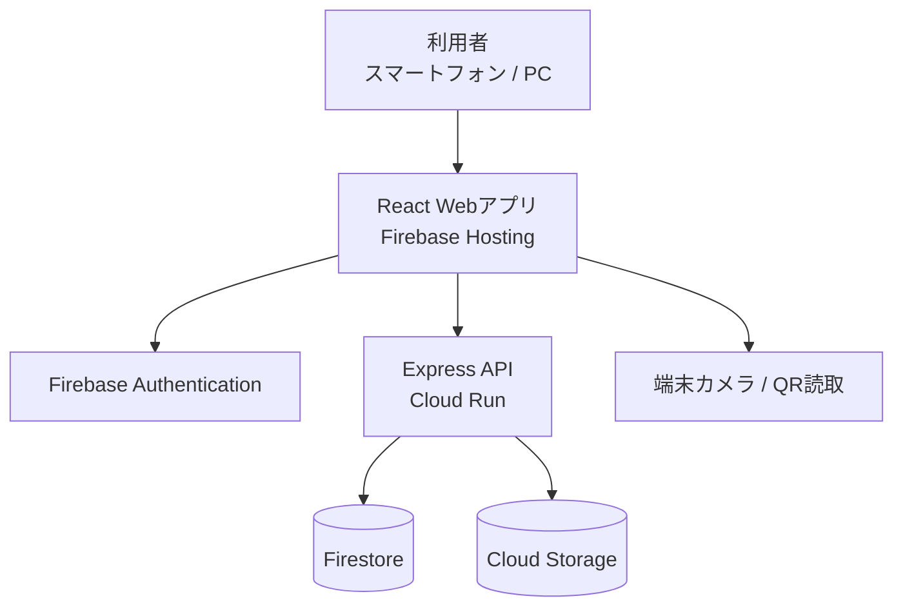
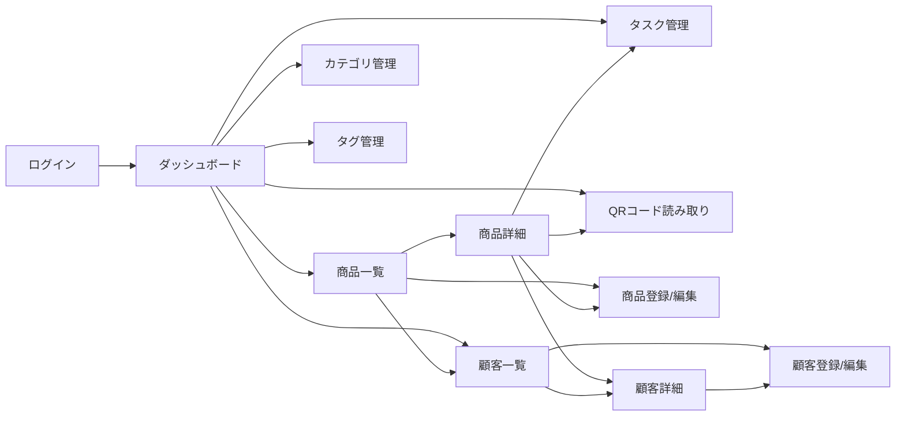
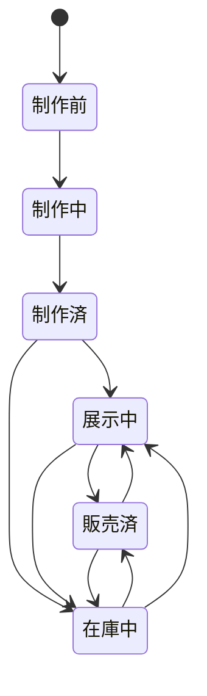
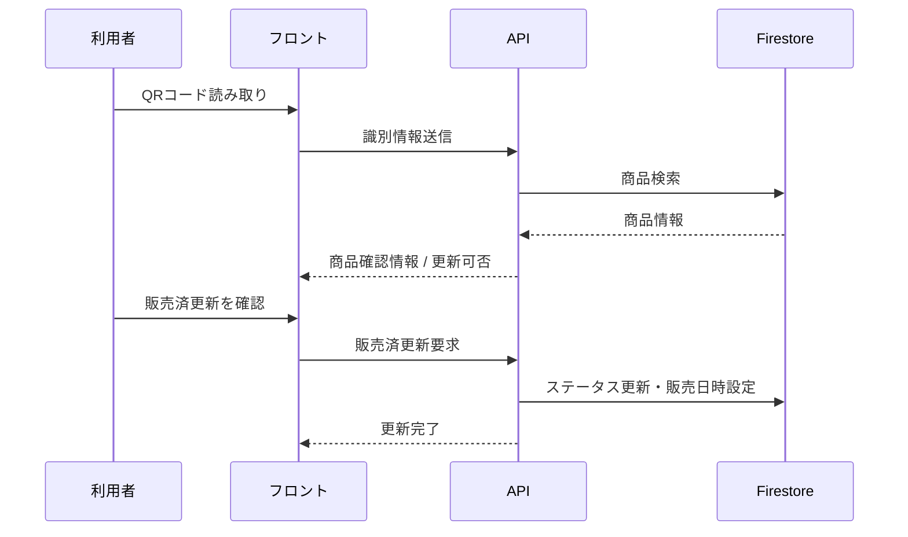
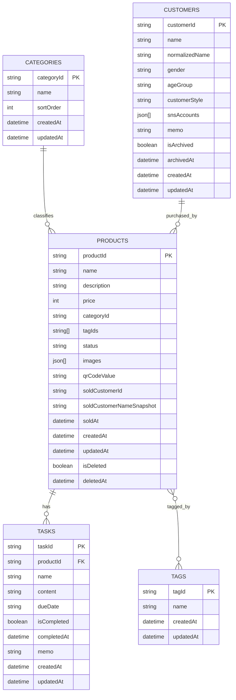

# ハンドメイド在庫・販売管理アプリ 基本設計書

## 1. 目的

本書は、要件定義書をもとに、MVPとして実装するハンドメイド在庫・販売管理アプリの基本設計を定義するものである。  
主に以下を明確化する。

- システム構成
- 画面構成
- 機能ごとの基本仕様
- データ構成
- 画面・API・ストレージ間の責務分担
- 非機能要件を満たすための設計方針

本書は実装前提の基本方針を定めるものであり、項目レベルの入出力、APIリクエスト/レスポンス詳細、例外処理の網羅、UI部品単位の挙動などは詳細設計で補完する。

---

## 2. システム概要

### 2.1 システムの目的

個人で制作・販売する一点物のハンドメイド商品について、以下をスマートフォン中心で一元管理する。

- 商品情報
- 商品画像
- 制作・展示・在庫・販売状況
- 商品ごとのタスク
- カテゴリ・タグ
- QRコードによる商品識別と販売済更新
- 顧客情報
- 顧客別購入履歴
- ダッシュボードによる状況把握

### 2.2 対象ユーザー

- アプリ利用者本人のみ
- 複数ユーザー利用は対象外

### 2.3 MVP対象範囲

MVPでは以下を対象とする。

- ログイン / ログアウト / パスワード再設定
- 商品登録 / 一覧 / 詳細 / 編集 / 論理削除
- 商品画像登録 / 差し替え / 削除
- カテゴリ・タグ管理
- ステータス管理
- 商品別タスク管理
- QRコード表示
- QRコード読み取りによる販売済更新
- 顧客一覧 / 詳細 / 登録 / 編集 / アーカイブ
- 顧客別購入履歴表示
- ダッシュボード表示
- 共通バリデーション / エラー表示

### 2.4 対象外

- 複数ユーザー管理
- 決済機能
- 配送連携
- 会計処理
- 外部EC自動連携
- 複数個在庫管理

---

## 3. 設計方針

### 3.1 全体方針

- モバイルファーストで設計する
- 単独利用前提のため、操作の早さと分かりやすさを優先する
- PCではレスポンシブ対応により一覧性を高める
- MVPでは拡張性を確保しつつ、過度に複雑な仕組みは避ける
- 商品は一点物として扱い、数量概念は持たない
- 商品の現在状態を正として管理し、履歴管理は将来拡張とする

### 3.2 技術構成方針

| 区分 | 採用技術 | 役割 |
|---|---|---|
| フロントエンド | React + TypeScript + Vite | 画面表示、入力、カメラ利用、QR読取、状態管理 |
| バックエンド | Node.js + TypeScript + Express | API提供、ID採番、業務ルール適用 |
| ホスティング | Firebase Hosting | フロント配信 |
| 実行基盤 | Cloud Run | バックエンド実行 |
| データベース | Firestore | 商品、タスク、カテゴリ、タグ、顧客、主要操作ログ等の保存 |
| ファイル保存 | Cloud Storage | 商品画像、サムネイル画像保存 |
| 認証 | Firebase Authentication | ログイン、セッション管理、パスワード再設定 |

### 3.3 責務分担方針

| 層 | 主な責務 |
|---|---|
| フロント | 画面表示、入力チェックの一次検証、認証状態監視、一覧条件管理、QR読取UI |
| API | 業務ルール判定、データ整合性担保、採番、論理削除制御、販売済更新制御 |
| DB/Storage | 永続化、検索対象データ保持、画像保管 |

### 3.4 日時方針

- 保存は日時型で保持する
- 表示は日本時間（JST / UTC+09:00）とする
- 表示形式は以下に統一する
  - 日時: `YYYY/MM/DD HH:mm`
  - 日付: `YYYY/MM/DD`

### 3.5 削除方針

| 対象 | 削除方式 |
|---|---|
| 商品 | 論理削除 |
| タスク | 物理削除 |
| カテゴリ | 物理削除（未使用のみ） |
| タグ | 物理削除（未使用のみ） |
| 商品画像 | ストレージ上の実体削除 + 商品情報更新 |
| 顧客 | アーカイブ |

補足:
- 論理削除した商品に紐づくタスク・画像は保持する
- ただし通常画面および通常APIからは参照不可とする
- 商品削除後の関連タスク件数集計、画像表示、QR利用は無効とする

---

## 4. システム構成

### 4.1 構成図



### 4.2 通信方式

| 通信 | 方式 | 用途 |
|---|---|---|
| フロント ↔ API | HTTPS / JSON | 商品、タスク、カテゴリ、タグ、顧客、顧客別購入履歴、ダッシュボード、QR販売更新 |
| フロント ↔ Firebase Auth | SDK | 認証、ログイン状態維持、パスワード再設定 |
| フロント ↔ カメラ | ブラウザAPI | QRコード読み取り |

### 4.3 認証・認可方針

- Firebase Authentication により本人認証を行う
- APIは認証済みトークンを検証して処理を許可する
- APIはトークン検証後、MVPでは運用で定めた単一の利用者メールアドレスとの一致確認を行う
- 未認証時は管理画面にアクセス不可とする
- 本人のみ利用前提のため、ロール管理は行わない

### 4.4 セッション・ログアウト方針

- 保護対象画面の共通ヘッダまたはメニューから常時ログアウトできる構成とする
- ログアウト実行時は Firebase Authentication のセッションを破棄し、ローカル保持の画面状態・検索条件キャッシュを破棄してログイン画面へ遷移する
- 商品一覧の検索条件は通常はURLクエリ文字列で保持してよいが、ログアウト後の再ログイン時には復元しない
- ログアウト後の初期画面はダッシュボードとし、一覧画面へ直接再訪した場合も一覧条件は初期状態から開始する
- URL上に過去の検索条件が残っている場合でも、ログアウト直後の再ログイン時には復元対象として扱わない
- 未ログイン状態で保護対象URLへアクセスした場合はログイン画面へリダイレクトし、ログイン後の初期画面はダッシュボードとする
- API応答で `401` を受けた場合はセッション切れとみなし、メッセージ表示後にログイン画面へ遷移する
- API応答で `403` を受けた場合は利用不可メッセージを表示し、再ログイン導線付きでログイン画面へ遷移する

---

## 5. 画面設計

## 5.1 画面一覧

| 画面ID | 画面名 | 主目的 |
|---|---|---|
| SCR-01 | ログイン画面 | ログイン、パスワード再設定導線 |
| SCR-02 | ダッシュボード画面 | 状況の俯瞰確認 |
| SCR-03 | 商品一覧画面 | 商品検索、絞り込み、一覧表示 |
| SCR-04 | 商品詳細画面 | 商品情報、画像、タスク、QR表示・QR読み取り導線 |
| SCR-05 | 商品登録/編集画面 | 商品情報の登録・更新 |
| SCR-06 | タスク管理画面 | 商品別タスクの登録・編集・削除 |
| SCR-07 | カテゴリ管理画面 | カテゴリの追加・編集・削除 |
| SCR-08 | タグ管理画面 | タグの追加・編集・削除 |
| SCR-09 | QRコード読み取り画面 | QR読み取り、販売済更新 |
| SCR-10 | 販売済更新確認ダイアログ | 販売済更新の確認 |
| SCR-11 | 共通確認ダイアログ | 削除・状態戻し等の確認 |
| SCR-12 | 顧客一覧画面 | 顧客検索、最終購入情報確認 |
| SCR-13 | 顧客詳細画面 | 顧客情報、購入商品一覧確認 |
| SCR-14 | 顧客登録/編集画面 | 顧客情報の登録・更新 |

## 5.2 画面遷移



## 5.3 ナビゲーション方針

- ログイン後の初期画面はダッシュボードとする
- 主要導線として下部または上部に主要メニューを配置する
  - ダッシュボード
  - 商品一覧
  - QR読み取り
  - 顧客一覧
  - カテゴリ/タグ管理
- 商品登録は商品一覧から遷移する
- 商品編集、タスク管理は商品詳細から遷移する
- ダッシュボードの「納期が近いタスク一覧」からは、対象商品コンテキスト付きでタスク管理画面へ遷移できる
- 保護対象画面の共通ヘッダまたはメニューにログアウト導線を配置する
- ログイン後の主要操作は最短経路で5タップ以内に収まる導線とする

### 5.3.1 主要操作導線とタップ数方針

| 操作 | 想定導線 | 目標 | 受入れ基準 |
|---|---|---:|---:|
| 商品一覧から商品詳細表示 | 一覧行タップ | 1タップ | 5タップ以内 |
| 商品一覧から商品新規登録画面表示 | 一覧画面の新規登録ボタン | 1タップ | 5タップ以内 |
| 商品詳細からタスク完了状態の変更 | 商品詳細の関連タスクから完了切替 | 1〜2タップ | 5タップ以内 |
| QRコード読み取り画面から販売済更新確認の実行 | QR読み取り → 確認実行 | 1タップ（読取後） | 5タップ以内 |

補足:
- タップ数測定はログイン完了後の通常利用状態から開始する
- スクロール、文字入力、OS権限許可ダイアログ操作はタップ数に含めない
- 最短操作経路で評価する

### 5.3.2 PC利用時のレスポンシブ方針

- PCでは一覧性向上を優先し、商品一覧で表示列数を増やす
- 商品一覧では、少なくとも商品サムネイル、商品名、商品ID、ステータス、カテゴリ、更新日時を同時に視認しやすいレイアウトとする
- 検索・絞り込み条件は、PCでは横並びまたはサイド配置を許容し、一覧の表示件数を確保する
- ダッシュボードおよびカテゴリ/タグ管理などの管理系画面は、PCでは2カラム相当のレイアウトを許容する
- スマートフォンとPCで機能差は設けず、同等機能を提供する

### 5.3.3 認証切れ・ログアウト時の画面遷移方針

- 未ログイン状態で保護対象画面へ直接アクセスした場合はログイン画面へ遷移する
- ログアウト実行後はログイン画面へ遷移し、保護対象画面へ戻るブラウザ操作では再表示前に認証確認を行う
- `401` 発生時は「セッションが切れました。再度ログインしてください。」を表示し、ログイン画面へ遷移する
- `403` 発生時は「この操作は実行できません。」を表示し、ログイン画面へ遷移する

## 5.4 共通画面状態方針

| 状態 | 対象画面 | 表示方針 | 利用者導線 |
|---|---|---|---|
| 読み込み中 | ダッシュボード、商品一覧、商品詳細、QR読取結果、各管理画面 | スピナーまたはスケルトンを表示し、二重送信を防ぐ | 読み込み完了まで待機 |
| 0件/対象なし | 商品一覧、関連タスク一覧、カテゴリ一覧、タグ一覧、最近更新商品 | 条件に応じた0件メッセージを表示する | 条件変更、新規登録、再読込 |
| 集計0件 | ダッシュボード | 件数カードは `0` を表示し、空状態でもレイアウトを維持する | 通常操作を継続 |
| 通信失敗 | 一覧、詳細、ダッシュボード、QR販売更新、各管理画面 | エラーメッセージと再試行ボタンを表示する | 同一条件で再試行 |
| 認証切れ | 保護対象画面全般 | セッション切れメッセージを表示する | ログイン画面へ遷移し再ログイン |

補足:
- 再試行時は、直前の検索条件・絞り込み条件・表示中ページを保持したまま同一要求を再送する
- 商品一覧の検索結果が0件の場合は「条件に一致する商品はありません。検索条件を変更してください。」を表示し、条件クリア導線を併設する
- 商品詳細で対象商品が取得不可の場合は、エラーメッセージ表示後に商品一覧へ戻る導線を表示する
- QR読取失敗時はカメラを継続利用できる状態に戻し、再読取を可能とする

---

## 6. 画面別基本仕様

## 6.1 ログイン画面

### 目的

利用者本人の認証を行う。

### 主な表示項目

- メールアドレス入力
- パスワード入力
- ログインボタン
- パスワード再設定リンク
- エラーメッセージ
- パスワード再設定ダイアログ

### 基本動作

- Firebase Authentication を使用してログインする
- 認証成功後は ID トークンを取得し、`POST /api/auth/login-record` を1回呼び出す
- `POST /api/auth/login-record` の記録成功後にダッシュボードへ遷移する
- `POST /api/auth/login-record` の記録失敗時は共通エラーを表示し、ログイン画面に留めて再試行可能とする
- 認証失敗時はメッセージ表示する
- ログイン状態は一定期間保持する
- ログアウト後およびセッション切れ後の再ログイン遷移先として利用する
- セッション切れ時は「セッションが切れました。再度ログインしてください。」を表示する
- パスワード再設定リンク押下時は、ログイン画面内で再設定ダイアログを表示する
- メールアドレス入力済みの場合は、その値を再設定ダイアログの初期値として利用する
- 再設定メールは Firebase Authentication の標準機能で送信する
- 再設定メール送信後は、成功または失敗メッセージを表示する

## 6.2 ダッシュボード画面

### 目的

全体状況を短時間で把握する。

### 主な表示項目

- ステータス別商品件数
- 販売済件数
- 未完了タスク件数
- 納期が近いタスク一覧
- 最近更新した商品（最大5件）

補足:
- 要件定義書内の「未完了タスク一覧」という表現揺れは、本設計では「未完了タスク件数」と「納期が近いタスク一覧」に分けて整理する
- MVPでは未完了タスク全件一覧はダッシュボードの対象外とし、一覧表示が必要な場合は「納期が近いタスク一覧」で代替する

### 基本動作

- ログイン直後に表示する
- 初回表示時はローディング表示を行う
- 論理削除済み商品は集計対象外とする
- 納期が近いタスク一覧は当日を含む7日以内の未完了タスクを対象とする
- 集計対象が0件の場合でも各件数カードは `0` を表示する
- 最近更新商品または納期が近いタスク一覧が0件の場合は対象なしメッセージを表示する
- 納期が近いタスク一覧の行を選択すると、該当商品のタスク管理画面へ遷移する
- タスク管理画面では対象商品コンテキストを保持した状態で対象タスクを確認できる
- 通信失敗時はエラーメッセージと再試行導線を表示する

## 6.3 商品一覧画面

### 目的

商品を一覧で確認し、検索・絞り込み・詳細遷移を行う。

### 主な表示項目

- 商品サムネイル
- 商品名
- 商品ID
- ステータス
- カテゴリ
- 更新日時
- 検索欄
- カテゴリ絞り込み（1件選択）
- タグ絞り込み（1件選択）
- ステータス絞り込み（1件選択）
- 並び替え
- 販売済表示/非表示切替
- 新規登録ボタン

### 基本動作

- 初期表示は更新日時降順とする
- 初回表示時および検索条件変更時はローディング表示を行う
- 検索対象は商品名、商品説明、商品ID、カテゴリ名、タグ名とする
- MVPではカテゴリ、タグ、ステータスの絞り込みはそれぞれ1件ずつ選択する方式とする
- キーワード検索と絞り込みはAND条件で適用する
- 検索キーワードは前後空白を除去し、連続空白は単一空白相当で扱う
- 英字は大文字・小文字を区別せずに比較する
- 英数字および記号の全角/半角差は可能な範囲で吸収して比較する
- ひらがな/カタカナは別文字として扱い、自動同一視は行わない
- 空文字のみが入力された場合はキーワード未指定として扱う
- 販売済商品は初期表示で区別表示し、除外表示に切替可能とする
- 商品一覧APIの既定取得件数は50件、最大100件とする
- 検索結果が0件の場合は0件メッセージと条件クリア導線を表示する
- 通信失敗時は直前条件を保持したまま再試行できるようにする

## 6.4 商品詳細画面

### 目的

商品の詳細情報と関連情報を確認し、QR表示およびQR読み取り導線を提供する。

### 主な表示項目

- 商品ID
- 商品名
- 商品説明
- 価格
- カテゴリ
- タグ
- ステータス
- 販売日時
- 代表画像
- 画像一覧
- 関連タスク一覧
- QRコード
- QR読み取りボタン
- 編集ボタン
- 削除ボタン

### 基本動作

- 初回表示時はローディング表示を行う
- 代表画像未設定時、画像が存在すれば先頭画像を代表表示する
- 画像未登録時はプレースホルダー表示とする
- 関連タスクは未完了を優先表示し、完了済みを切替表示できる
- 関連タスクの完了切替は商品詳細画面から実行でき、完了状態と完了日時のみを更新する
- QRコードは商品を一意に識別できる値を元に表示する
- QR読み取りボタンから QRコード読み取り画面へ遷移できる
- 対象商品が存在しない、または論理削除済みで取得不可の場合はエラーメッセージを表示し、商品一覧へ戻る導線を表示する
- 通信失敗時は再試行導線を表示する

## 6.5 商品登録/編集画面

### 目的

商品情報を登録・更新する。

### 入力項目

| 項目 | 必須 | 備考 |
|---|---|---|
| 商品ID | 自動 | 編集不可、表示のみ |
| 商品名 | 必須 | 最大100文字 |
| 商品説明 | 任意 | 最大2,000文字 |
| 価格 | 必須 | 0以上の整数 |
| カテゴリ | 必須 | 1件選択 |
| タグ | 任意 | 複数選択 |
| 商品画像 | 任意 | 最大10枚。新規登録時は初回保存後に追加 |
| 代表画像 | 任意 | 保存済み画像から選択。新規登録時は初回保存後に設定 |
| ステータス | 必須 | 1件選択 |

### 基本動作

- 商品登録時はAPIで商品IDを採番する
- 新規登録時は基本情報のみを保存し、保存成功後は商品詳細画面へ遷移する
- 画像追加および代表画像設定は保存済み商品に対して行う
- 保存時に入力チェックを実施する
- 販売済へ変更した場合、既存の販売日時が未設定なら販売日時を設定する
- 既に販売済の商品へ再度販売済を設定しても `soldAt` は上書きしない
- 販売済から戻す場合は確認を必須とする
- 販売済から展示中 / 在庫中 / その他ステータスへ戻した場合は `soldAt` を `null` に更新する
- 通信失敗時は入力内容を保持したまま再送またはキャンセルを選択できるようにする

## 6.6 タスク管理画面

### 目的

商品ごとのタスクを管理する。

### 主な表示項目

- タスク名
- 納期
- 完了状態
- タスク内容
- メモ
- 追加ボタン
- 編集ボタン
- 削除ボタン
- 完了済み表示切替

### 基本動作

- 未完了を初期表示とする
- 納期昇順、納期未設定は後ろに並べる
- 完了時は完了日時を設定する
- 未完了へ戻した場合は完了日時を解除する
- 削除時は確認ダイアログを表示する

## 6.7 カテゴリ管理画面 / タグ管理画面

### 目的

カテゴリ・タグの追加、更新、削除を行う。

### 基本動作

- 名称は前後空白を除去して保存する
- 同名は登録不可とする
- 未使用のみ削除可能とする
- 削除時は確認ダイアログを表示する
- 未使用判定は、論理削除されていない商品から参照されていないことを条件とする

## 6.8 QRコード読み取り画面

### 目的

現場でQRコードを読み取り、販売済更新を素早く行う。

### 主な表示項目

- カメラプレビュー
- 読み取り結果
- 商品確認表示
- 販売済更新確認
- エラーメッセージ
- 再試行導線

### 基本動作

- 読み取った識別情報から商品を特定する
- 読取中および販売済更新要求中はローディング表示を行う
- 対象商品のステータスに応じて更新可否を判定する
- 展示中 / 在庫中のみ販売済更新を許可する
- 既に販売済なら重複更新せず、メッセージのみ表示する
- 論理削除済み商品は無効扱いとする
- 読み取り失敗、通信失敗、更新失敗時はいずれも再試行導線を表示する

---

## 6.9 顧客管理の基本仕様

### 目的
- リピーター顧客の情報と購入傾向を一元管理する
- 販売済商品への購入者紐付けを、商品編集画面およびQR販売済更新画面から行えるようにする

### 基本方針
- 顧客は `customers` コレクションで管理する
- 顧客IDは `counters/customer` をトランザクション更新して `cus_000001` 形式で採番し、再利用しない
- 電話番号、メールアドレスはMVPでは保持しない
- 顧客削除は物理削除ではなく `isArchived=true` によるアーカイブとする
- 顧客アーカイブ時は `archivedAt` を設定する
- 顧客別購入履歴は別 `sales` コレクションを正本にせず、`products.status=sold` と `soldCustomerId` から導出する
- 販売済商品の購入者は未設定でもよい

### 顧客画面
- 顧客一覧画面では顧客名、最終購入日、最終購入商品、購入回数を表示する
- 顧客詳細画面では顧客属性、SNSアカウント、メモ、購入商品一覧を表示する
- 顧客登録/編集画面では `name`、`gender`、`ageGroup`、`customerStyle`、`snsAccounts`、`memo` を扱う


## 7. 機能設計

## 7.1 認証機能

### 概要

Firebase Authentication によるメールアドレス + パスワード認証を採用する。

### 基本仕様

- 未ログイン時は保護対象画面へ遷移不可
- Firebase Authentication による認証成功後、IDトークン取得と `POST /api/auth/login-record` の記録成功後にダッシュボードへ遷移する
- ログアウト可能
- パスワード再設定メール送信可能

### 設計方針

- フロントで認証状態を監視する
- API呼び出し時は認証トークンを付与する
- API側でトークン検証を行う
- 保護対象画面の共通ヘッダまたはメニューにログアウト導線を配置する
- `401` / `403` は共通ハンドラで処理し、再ログイン導線付きでログイン画面へ遷移する
- ログアウト時は画面状態キャッシュ、直前の検索条件キャッシュを破棄する

## 7.2 商品管理機能

### 7.2.1 商品登録

#### 業務ルール

- 商品IDは自動採番する
- 商品名、価格、カテゴリ、ステータスは必須
- 商品は一点物として管理する
- MVPでは `POST /api/products` で画像および代表画像指定は受け付けない
- 新規登録成功後は商品詳細画面へ遷移し、以後の画像追加・代表画像設定を実施する

#### 商品ID採番方針

- 表示形式: `HM-000001`
- 一意性を保証するため、採番カウンタをサーバ側で管理する
- 論理削除後も再利用しない

#### 設計案

- Firestore に採番用ドキュメント `counters/product` を持つ
- APIにてトランザクションで連番更新し、商品IDを採番する

### 7.2.2 商品編集

#### 業務ルール

- 登録済み商品を更新できる
- ステータス更新時は更新日時を更新する
- 手動更新では全ステータス変更を許可する
- 販売済から戻す場合は確認を必須とする
- 販売済から他ステータスへ戻した場合は `soldAt=null` とする

### 7.2.3 商品一覧

#### 検索・絞り込み仕様

- 条件はキーワード、カテゴリ、タグ、ステータス、販売済表示切替
- MVPではカテゴリ、タグ、ステータスの絞り込み条件はそれぞれ1件ずつ選択する方式とする
- 条件はすべてANDで判定
- 初期表示順は更新日時降順
- 並び替え対象は更新日時、商品名
- 検索キーワードは前後空白を除去し、連続空白は単一空白相当で扱う
- 英字は大文字・小文字を区別せずに比較する
- 英数字および記号の全角/半角差は可能な範囲で吸収して比較する
- ひらがな/カタカナは別文字として扱い、自動同一視は行わない
- 空文字のみが入力された場合はキーワード未指定として扱う

#### 実装方針

- MVPでは検索条件に応じてAPIが一覧取得を行う
- `categoryId` / `tagIds` を正としつつ、検索時はAPIでカテゴリ・タグのマスタ名称を突合し、商品名・商品説明・商品ID・カテゴリ名・タグ名を検索対象文字列として組み立てる
- 検索対象文字列は、前後空白除去、連続空白の単一化、英字の小文字化、英数字および記号の全角/半角差の吸収を行った上で部分一致判定する
- Firestoreでは `isDeleted`、カテゴリ、タグ、ステータスなど絞り込み可能な条件を先に適用し、その結果に対してAPIでキーワード検索を後段適用する
- 件数規模は100件程度を想定し、MVPでは全文検索エンジンや検索専用インデックスは導入せず、APIでの後段絞り込みで実用性を優先する
- 並び替えとページングは、API内部で全条件適用後の結果に対して実施する

#### 取得単位・ページング方針

- 商品一覧取得APIは `page`、`pageSize`、`sortBy`、`sortOrder`、`keyword`、`categoryId`、`tagId`、`status`、`includeSold` を受け付ける
- `page` の既定値は `1`、`pageSize` の既定値は `50`、最大値は `100` とする
- 画面初期表示、検索条件変更、並び替え変更時は `page=1` に戻して再取得する
- APIレスポンスには `items`、`totalCount`、`page`、`pageSize`、`hasNext` を含める
- 2ページ目以降の再試行時は直前の `page` と条件を維持して再取得する

### 7.2.4 商品詳細

#### 表示内容

- 基本情報
- 画像
- カテゴリ、タグ
- ステータス
- 販売日時
- 関連タスク
- QRコード

### 7.2.5 商品削除

#### 業務ルール

- 論理削除とする
- 削除前に確認ダイアログを表示する
- 削除済み商品は一覧、検索、ダッシュボードから除外する
- QR読み取り時は無効とする
- 論理削除した商品に紐づく関連タスク・画像は保持するが、通常画面からは参照不可とする

#### 設計方針

- `isDeleted=true` と `deletedAt` を保存する
- 通常取得APIでは `isDeleted=false` のみ対象とする
- 商品詳細取得、商品別タスク取得、商品画像取得相当の通常APIでは、論理削除済み商品を参照不可とする
- ダッシュボード集計では、論理削除済み商品に紐づくタスクを除外する

## 7.3 商品画像管理機能

### 概要

商品に対して最大10枚の画像を管理する。

### 業務ルール

- 画像形式: JPEG / PNG / WebP
- 1ファイル10MB以下
- 長辺2000px超は縮小保存
- 表示用画像とサムネイルを生成する
- サムネイルは一覧表示用として長辺400px程度で生成する
- 元画像は保持しない
- 画像表示順は `sortOrder` により管理し、登録順を基準とする

### 保存方針

- Cloud Storage に保存する
- 表示用画像とサムネイルを別パスで保存する
- 商品には画像メタ情報を保持する
- 論理削除済み商品の画像はストレージ上に保持するが、通常画面では参照させない

### API責務方針

- `POST /api/products` は商品基本情報のみを受け付け、画像および代表画像指定は受け付けない
- 商品基本情報更新は `PUT /api/products/:productId` で行い、`name`、`description`、`price`、`categoryId`、`tagIds`、`status`、`primaryImageId` を全項目送信で受け付ける
- `primaryImageId` は代表画像を変更しない場合も必ず送信し、代表画像なしの場合は `null` を明示する
- 画像実体の追加は `POST /api/products/:productId/images`、差し替えは `PUT /api/products/:productId/images/:imageId`、削除は `DELETE /api/products/:productId/images/:imageId` で行う
- `primaryImageId` が更新された場合、APIは対象画像を `isPrimary=true`、その他画像を `false` に正規化して保存する
- 代表画像として指定された画像が削除された場合は、残画像のうち `sortOrder` 最小の画像を代表扱いとする
- 永続保持する画像メタ情報は `displayPath` / `thumbnailPath` とし、`displayUrl` / `thumbnailUrl` は取得 API 応答時に生成する期限付き URL とする

### 表示順制御

- 画像追加時は、既存画像の `sortOrder` 最大値 + 1 を付与し、末尾に追加する
- 画像差し替え時は、対象 `imageId` と `sortOrder` を維持したまま画像実体のみ更新する
- 画像削除時は、残画像の `sortOrder` を 1 から連番で詰め直し、欠番を残さない
- 明示的な代表画像が未設定の場合は、`sortOrder` 最小の画像を表示上の代表画像とする

### 画像メタ情報例

```json
{
  "imageId": "img_001",
  "displayPath": "products/HM-000001/display/img_001.webp",
  "thumbnailPath": "products/HM-000001/thumb/img_001.webp",
  "sortOrder": 1,
  "isPrimary": true
```

補足:
- `displayUrl` / `thumbnailUrl` は永続保存せず、商品一覧・商品詳細 API 応答時に期限付き URL として生成する

### 代表画像制御

- 明示設定がある場合はその画像を代表とする
- 代表未設定かつ画像ありの場合、`sortOrder` 最小の画像を代表扱いとする
- 代表画像削除時、残画像があれば `sortOrder` 最小の画像を代表扱いとする
- 画像が0件になった場合は代表画像未設定状態とし、プレースホルダー表示へ切り替える

## 7.4 ステータス管理機能

### 対象ステータス

- 制作前
- 制作中
- 制作済
- 展示中
- 在庫中
- 販売済

### ステータス遷移図

以下は通常運用および代表的な例外遷移を示す。  
手動更新では全ステータス変更を許可するが、業務上の標準運用は下図を基本とする。



### 設計方針

- 手動更新では全ステータス変更を許可する
- ただし販売済から戻す場合は確認必須
- 販売済へ変更時、未設定なら販売日時を設定する
- 販売済から他ステータスへ戻した場合は `soldAt=null` とする
- 既に販売済の商品へ再度販売済を設定しても `soldAt` は上書きしない

## 7.5 タスク管理機能

### 概要

商品単位で複数のタスクを管理する。

### 項目

| 項目 | 必須 | 備考 |
|---|---|---|
| タスク名 | 必須 | 最大100文字 |
| タスク内容 | 任意 | 最大2,000文字 |
| 納期 | 任意 | 日付 |
| メモ | 任意 | 最大1,000文字 |
| 完了状態 | 自動 | 初期値は未完了 |

### 基本動作

- タスク完了時に完了日時を設定する
- 未完了へ戻した場合は完了日時を解除する
- 商品詳細画面での完了切替は `PATCH /api/tasks/:taskId/completion` により完了状態と完了日時のみを更新する
- 削除時は確認ダイアログを表示する
- 削除は物理削除とする

## 7.6 カテゴリ・タグ管理機能

### 共通方針

- マスタとして管理する
- 名称はトリムして保存する
- 一意制約を持たせる
- 未使用のみ削除可

### 設計方針

- カテゴリとタグは独立コレクションで保持する
- 商品にはカテゴリID、タグID配列を持たせる
- 削除実行前は確認ダイアログを表示する

## 7.7 QRコード機能

### QRコード発行

- 商品ごとに一意な識別情報を埋め込む
- MVPでは商品IDをベースとした識別情報を利用する
- 同一商品には同一QRコードを利用する

### QRコード読み取り

#### 更新可否判定

| 現在ステータス | 結果 |
|---|---|
| 展示中 | 販売済へ更新可 |
| 在庫中 | 販売済へ更新可 |
| 販売済 | 更新せず「既に販売済」表示 |
| 制作前 / 制作中 / 制作済 | 更新不可メッセージ |
| 論理削除済み | 無効QR扱い |
| 未登録 | エラー |

#### 処理フロー



## 7.8 ダッシュボード機能

### 集計項目

- ステータス別件数
- 販売済件数
- 未完了タスク件数
- 納期が近いタスク一覧
- 最近更新した商品

### 集計方針

- 論理削除済み商品は除外
- 論理削除済み商品に紐づくタスクも除外
- 未完了タスク件数は、論理削除されていない商品に紐づく未完了タスクを対象に集計する
- 納期が近いタスク一覧は、当日を含む7日以内が納期の未完了タスクを対象とする
- 最近更新した商品は最大5件

---

## 8. データ設計


## 8.1 論理データモデル



補足:
- Firestoreでは商品画像を別コレクションではなく `products` ドキュメント内の埋め込み配列 `images` として保持する
- タグは正規化マスタ `tags` を持ちつつ、商品側には参照配列 `tagIds` を保持する
- 顧客別購入履歴は別 `sales` コレクションを持たず、`products.status=sold` と `soldCustomerId` から導出する
- ER図上の `images` は画像メタ情報の配列を表す簡略表記であり、詳細項目は「8.3 商品データ」のドキュメント例に従う

## 8.2 Firestoreコレクション案

| コレクション | 用途 |
|---|---|
| `products` | 商品本体 |
| `tasks` | タスク |
| `categories` | カテゴリ |
| `tags` | タグ |
| `customers` | 顧客マスタ |
| `counters` | 商品ID・顧客ID採番などの連番管理 |
| `operationLogs` | 主要操作ログ |

## 8.3 商品データ

### ドキュメント例

```json
{
  "productId": "HM-000001",
  "name": "春色ピアス",
  "description": "淡い色合いのハンドメイドピアス",
  "price": 2800,
  "categoryId": "cat_001",
  "tagIds": ["tag_001", "tag_002"],
  "status": "onDisplay",
  "images": [
    {
      "imageId": "img_001",
      "displayPath": "products/HM-000001/display/img_001.webp",
      "thumbnailPath": "products/HM-000001/thumb/img_001.webp",
      "sortOrder": 1,
      "isPrimary": true
    }
  ],
  "qrCodeValue": "HM-000001",
  "soldCustomerId": null,
  "soldCustomerNameSnapshot": null,
  "soldAt": null,
  "createdAt": "2026-03-17T10:00:00Z",
  "updatedAt": "2026-03-17T10:00:00Z",
  "isDeleted": false,
  "deletedAt": null
}
```

### 主な設計ポイント

- `productId` は業務IDとして保持する
- FirestoreのドキュメントIDは `productId` と一致させる（MVP方針）。将来拡張で分離する場合は別途設計見直しを行う
- `tagIds` はタグマスタ参照の正データとして保持し、一覧検索や表示時にタグ名へ解決する
- `images` は表示順を保持する
- `sortOrder` は 1 開始の連番とし、追加時は末尾付与、削除時は詰め直しを行う
- 永続保存する画像メタ情報は `displayPath` / `thumbnailPath` であり、画面表示用 URL は取得 API 応答時に生成する
- 商品更新APIでは `primaryImageId` を受け取り、保存時は対応する画像へ `isPrimary=true` を反映する
- 代表画像は `isPrimary=true` で管理し、未設定時は `sortOrder` 最小を採用する

## 8.4 タスクデータ

```json
{
  "taskId": "task_001",
  "productId": "HM-000001",
  "name": "台紙を準備する",
  "content": "イベント用の台紙を作成",
  "dueDate": "2026-03-20",
  "isCompleted": false,
  "completedAt": null,
  "memo": "ラッピングも要確認",
  "createdAt": "2026-03-17T10:00:00Z",
  "updatedAt": "2026-03-17T10:00:00Z"
}
```

## 8.5 カテゴリデータ

```json
{
  "categoryId": "cat_001",
  "name": "ピアス",
  "sortOrder": 10,
  "createdAt": "2026-03-17T10:00:00Z",
  "updatedAt": "2026-03-17T10:00:00Z"
}
```

## 8.6 タグデータ

```json
{
  "tagId": "tag_001",
  "name": "春",
  "createdAt": "2026-03-17T10:00:00Z",
  "updatedAt": "2026-03-17T10:00:00Z"
}
```

## 8.7 インデックス方針

MVPでは以下の観点でインデックスを整備する。

### 商品一覧系

- `isDeleted + updatedAt`
- `isDeleted + status + updatedAt`
- `isDeleted + categoryId + updatedAt`
- `isDeleted + categoryId + status + updatedAt`
- `isDeleted + tagIds(array-contains) + updatedAt`
- `isDeleted + tagIds(array-contains) + status + updatedAt`

補足:
- 商品一覧ではカテゴリ絞り込み、タグ絞り込み、ステータス絞り込みを受け付けるため、Firestoreで先行適用する条件に応じた複合インデックスを定義する
- 並び順の既定は `updatedAt` 降順とするため、上記インデックスは `updatedAt` を含める
- 実装でカテゴリ + タグ + ステータスの同時先行絞り込みを行う場合は、`isDeleted + categoryId + tagIds(array-contains) + status + updatedAt` の追加を検討する

### タスク系

- `productId + isCompleted + dueDate`
- ダッシュボードの納期近いタスク取得で必要な場合は、`isCompleted + dueDate` を起点とした追加インデックスを検討する

### マスタ系

- カテゴリ名一意確認用
- タグ名一意確認用
- 顧客一覧用に `isArchived + updatedAt`、顧客検索用に `isArchived + normalizedName + updatedAt`
- 顧客別購入履歴用に `isDeleted + status + soldCustomerId + soldAt`

複雑な全文検索はMVP対象外とし、100件程度の運用規模を前提に実用性を担保する。

---

## 9. API基本設計

## 9.1 API一覧

| 区分 | メソッド | パス | 用途 |
|---|---|---|---|
| Auth連携 | - | Firebase SDK利用 | ログイン、ログアウト、再設定 |
| Auth | POST | `/api/auth/login-record` | ログイン成功記録 |
| Health | GET | `/api/health` | 運用確認用ヘルスチェック |
| Dashboard | GET | `/api/dashboard` | ダッシュボード情報取得 |
| Products | GET | `/api/products` | 商品一覧取得（ページング、検索、絞り込み、並び替え） |
| Products | POST | `/api/products` | 商品登録 |
| Products | GET | `/api/products/:productId` | 商品詳細取得 |
| Products | PUT | `/api/products/:productId` | 商品更新 |
| Products | DELETE | `/api/products/:productId` | 商品論理削除 |
| Product Images | POST | `/api/products/:productId/images` | 画像追加 |
| Product Images | PUT | `/api/products/:productId/images/:imageId` | 画像差し替え |
| Product Images | DELETE | `/api/products/:productId/images/:imageId` | 画像削除 |
| Tasks | GET | `/api/products/:productId/tasks` | タスク一覧取得 |
| Tasks | POST | `/api/products/:productId/tasks` | タスク登録 |
| Tasks | PUT | `/api/tasks/:taskId` | タスク更新 |
| Tasks | PATCH | `/api/tasks/:taskId/completion` | タスク完了状態切替 |
| Tasks | DELETE | `/api/tasks/:taskId` | タスク削除 |
| Categories | GET | `/api/categories` | カテゴリ一覧 |
| Categories | POST | `/api/categories` | カテゴリ登録 |
| Categories | PUT | `/api/categories/:categoryId` | カテゴリ更新 |
| Categories | DELETE | `/api/categories/:categoryId` | カテゴリ削除 |
| Tags | GET | `/api/tags` | タグ一覧 |
| Tags | POST | `/api/tags` | タグ登録 |
| Tags | PUT | `/api/tags/:tagId` | タグ更新 |
| Tags | DELETE | `/api/tags/:tagId` | タグ削除 |
| Customers | GET | `/api/customers` | 顧客一覧取得 |
| Customers | POST | `/api/customers` | 顧客登録 |
| Customers | GET | `/api/customers/:customerId` | 顧客詳細取得 |
| Customers | PUT | `/api/customers/:customerId` | 顧客更新 |
| Customers | DELETE | `/api/customers/:customerId` | 顧客アーカイブ |
| Customer Purchases | GET | `/api/customers/:customerId/purchases` | 顧客別購入商品一覧取得 |
| QR | POST | `/api/qr/lookup` | QR読取結果から商品特定 |
| QR | POST | `/api/qr/sell` | 販売済更新 |

## 9.2 API共通方針

- 業務APIは認証済みトークンを必須とする
- ただし、`GET /api/health` は運用確認用のため認証不要とする
- JSONを基本とする
- バリデーションエラーは 400 系で返却する
- 認証エラーは 401 / 403 を返却する
- 業務ルール違反はメッセージ付きで返却する
- 論理削除済み商品に紐づく通常参照APIは、HTTP 404 で参照不可を返却する
- 認証エラー時のレスポンス本文には、少なくとも `code` と `message` を含め、フロント共通処理でログイン画面遷移に利用する
- 商品一覧APIでは、`page`、`pageSize`、`totalCount`、`hasNext` を扱える設計とする
- 商品一覧APIの `pageSize` は既定値 `50`、最大値 `100` とする
- 商品別タスク一覧APIの `showCompleted` は未指定時 `false` とし、初期表示では未完了のみを取得する

## 9.3 エラーコード例

| 区分 | 例 | 内容 |
|---|---|---|
| `AUTH_REQUIRED` | 401 | 認証が必要 / セッション切れ |
| `AUTH_FORBIDDEN` | 403 | 認証済だが利用不可（本人メール不一致を含む） |
| `VALIDATION_ERROR` | 400 | 入力不正 |
| `PRODUCT_NOT_FOUND` | 404 | 商品未存在 |
| `PRODUCT_DELETED` | 404 | 論理削除済み |
| `PRODUCT_RELATED_RESOURCE_UNAVAILABLE` | 404 | 論理削除済み商品の関連情報参照不可 |
| `CUSTOMER_NOT_FOUND` | 404 / 400 | 顧客未存在 |
| `CUSTOMER_ARCHIVED` | 400 | アーカイブ済み顧客のため更新不可 |
| `INVALID_STATUS_FOR_QR_SELL` | 400 | QR販売更新不可 |
| `ALREADY_SOLD` | 400 | 既に販売済 |
| `CATEGORY_IN_USE` | 400 | 使用中カテゴリ |
| `TAG_IN_USE` | 400 | 使用中タグ |
| `IMAGE_LIMIT_EXCEEDED` | 400 | 画像上限超過 |

---

## 10. バリデーション設計

## 10.1 共通方針

- フロントで即時入力チェックを行う
- APIで最終チェックを再実施する
- サーバ側チェック結果を正とする
- 文字列入力は、システム上の制御文字や表示崩れを招く不正文字列を入力不可または無害化して保存する
- 単一行項目と複数行項目で許容文字を分け、詳細設計で許容/禁止文字一覧を定義する

## 10.2 主な入力制約

| 項目 | 制約 |
|---|---|
| 商品名 | 必須、最大100文字、空白のみ不可、改行不可、タブ不可、制御文字不可 |
| 商品説明 | 最大2,000文字、改行可、制御文字不可または無害化 |
| 価格 | 必須、0以上整数、小数不可 |
| タスク名 | 必須、最大100文字、空白のみ不可、改行不可、タブ不可、制御文字不可 |
| タスク内容 | 最大2,000文字、改行可、制御文字不可または無害化 |
| メモ | 最大1,000文字、改行可、制御文字不可または無害化 |
| カテゴリ名 | 必須、最大50文字、空白のみ不可、改行不可、タブ不可、制御文字不可 |
| タグ名 | 必須、最大50文字、空白のみ不可、改行不可、タブ不可、制御文字不可 |
| 検索キーワード | 最大100文字、改行不可、タブ不可、制御文字不可 |
| 画像 | JPEG/PNG/WebP、10MB以下、最大10枚 |

補足:
- 「制御文字不可または無害化」は、NUL 文字や画面表示崩れを招く非表示文字等を対象とする
- 複数行項目では改行を許容するが、保存時は表示崩れや処理系依存の問題を招く文字列を除去または置換する

## 10.3 正規化方針

- 商品名、タスク名、カテゴリ名、タグ名は前後空白を除去する
- カテゴリ名、タグ名の一意判定はトリム後の値で行う
- 検索キーワードは前後空白を除去し、連続空白は単一空白相当で扱う
- 英字は大文字・小文字を区別しない
- 英数字および記号の全角/半角差は可能な範囲で吸収して比較する
- ひらがな/カタカナは別文字として扱い、自動同一視は行わない
- 空文字のみが入力された場合はキーワード未指定として扱う
- 改行コードは保存時に LF に正規化し、想定外制御文字は除去または拒否する

---

## 11. セキュリティ設計

### 11.1 基本方針

- 通信はHTTPSとする
- 認証済み本人のみ利用可能とする
- 商品データ、画像データへの不正アクセスを防止する

### 11.2 実装方針

- Firebase Authentication による本人認証
- APIでトークン検証
- MVPでは `APP_OWNER_EMAIL` を既定とする allowlist で本人確認を補強し、不一致は `403` とする
- Storage へのアクセスは認証前提の制御とする
- 不要な公開URL設計を避ける

### 11.3 ログ方針

最低限以下を記録対象とする。

- ログイン
- 商品更新
- 販売済更新
- 論理削除
- 主要エラー

---

## 12. 非機能設計

## 12.1 操作性

- モバイル片手操作を重視する
- 主要操作は少ないタップ数で完了できるようにする
- ボタン、入力欄はタップしやすいサイズとする
- 主要操作は3タップ以内を目標、5タップ以内を受入れ基準とする

### 12.1.1 操作性評価対象

| 操作 | 評価条件 |
|---|---|
| 商品一覧から商品詳細表示 | ログイン後の一覧表示状態から最短経路で評価 |
| 商品一覧から商品新規登録画面表示 | ログイン後の一覧表示状態から最短経路で評価 |
| 商品詳細からタスク完了状態の変更 | 商品詳細表示状態から最短経路で評価 |
| QRコード読み取り画面から販売済更新確認の実行 | 読取成功後から最短経路で評価 |

補足:
- スクロール、文字入力、OS権限許可ダイアログ操作は評価対象外とする
- 屋外や展示会場を想定し、主要アクションは画面下部または上部の押しやすい位置に配置する

### 12.1.2 PC利用時の表示方針

| 画面 | 方針 |
|---|---|
| 商品一覧 | スマートフォンより表示列を増やし、一覧スクロール回数を抑える |
| ダッシュボード | 集計カードや最近更新商品を複数列で配置できるようにする |
| カテゴリ/タグ管理 | 一覧と操作領域の横配置を許容し、視認性を高める |

## 12.2 性能

### 目標/受入基準

| 項目 | 目標 | 受入れ基準 |
|---|---:|---:|
| 商品一覧初期表示 | 3秒以内 | 5秒以内 |
| 商品詳細表示 | 3秒以内 | 5秒以内 |
| QR読取成功後の確認画面表示 | 3秒以内 | 5秒以内 |

### 設計方針

- 一覧ではサムネイル画像を使用する
- 主要情報を先に表示し、補助要素は後続読込を許容する
- 商品一覧は既定50件単位で取得し、必要に応じて追加取得できる構成とする
- 商品件数100件程度を想定し、MVPとして実用速度を確保する

## 12.3 可用性・保守性

- クラウドマネージドサービスを活用し運用負荷を抑える
- 将来の売上管理、CSV出力、EC連携に備え、商品・カテゴリ・タグ・タスクを疎結合に保つ

## 12.4 バックアップ・復旧

- Firestore / Cloud Storage の標準運用を前提に保全する
- 復旧手順は運用設計で別途定義する

---

## 13. 主要処理の設計補足

## 13.1 商品登録処理

1. フロントで入力チェック
2. APIへ登録要求
3. APIで再バリデーション
4. 商品ID採番
5. 商品基本情報を保存
6. 正常応答で productId を返却
7. フロントは商品詳細画面へ遷移
8. 画像追加が必要な場合は保存済み商品に対して別 API で実行

## 13.2 商品削除処理

1. 削除確認表示
2. APIへ削除要求
3. `isDeleted=true`、`deletedAt` 設定
4. 関連タスク・画像は保持したまま通常参照対象から除外
5. 一覧・検索・集計・QR利用対象から除外

## 13.3 販売済更新処理

1. QRコード読取
2. 商品特定
3. ステータス確認
4. 更新可なら確認ダイアログ表示
5. 販売済へ更新
6. `soldAt` 未設定時のみ設定
7. 完了メッセージ表示

## 13.4 販売済からの状態戻し処理

1. 利用者が商品編集画面で販売済以外のステータスを選択
2. 確認ダイアログ表示
3. APIへ更新要求
4. ステータス更新
5. `soldAt=null` を設定
6. `updatedAt` を更新
7. 完了メッセージ表示

## 13.5 タスク / カテゴリ / タグ削除処理

1. 削除ボタン押下
2. 確認ダイアログ表示
3. APIへ削除要求
4. 使用可否または存在確認を実施
5. 物理削除実行
6. 一覧再取得または対象行を画面から除去

---

## 14. 関連文書で具体化済みの項目

本書で定めた基本方針のうち、以下の項目は関連文書で具体化済みである。実装・テスト時は各参照先を正本として扱う。

- 画面レイアウト詳細: `screen_design.md`
- APIリクエスト/レスポンス定義: `api_specification.md`
- Firestoreインデックス定義の最終版: `data_design.md` および `implementation-notes.md`
- 画像変換方式、命名規則、保存パス: `data_design.md` および `implementation-notes.md`
- QRコード生成ライブラリ、読み取りライブラリ: `implementation-notes.md`
- フロント状態管理方式: `implementation-notes.md`
- エラーメッセージ文言一覧: `error-messages.md`
- ログ出力項目と保持方針: `detail_design.md` および `implementation-notes.md`

補足:
- 本書は基本設計書として全体方針を定める
- 実装粒度の仕様は上記の関連文書を参照する

---

## 15. 付録

## 15.1 ステータス値一覧

| コード | 表示名 |
|---|---|
| `beforeProduction` | 制作前 |
| `inProduction` | 制作中 |
| `completed` | 制作済 |
| `onDisplay` | 展示中 |
| `inStock` | 在庫中 |
| `sold` | 販売済 |

## 15.2 主な設計上の前提

- 商品は一点物で数量概念を持たない
- 利用者は本人のみである
- 商品履歴管理はMVP対象外である
- 複雑な全文検索や外部サービス連携はMVP対象外である
