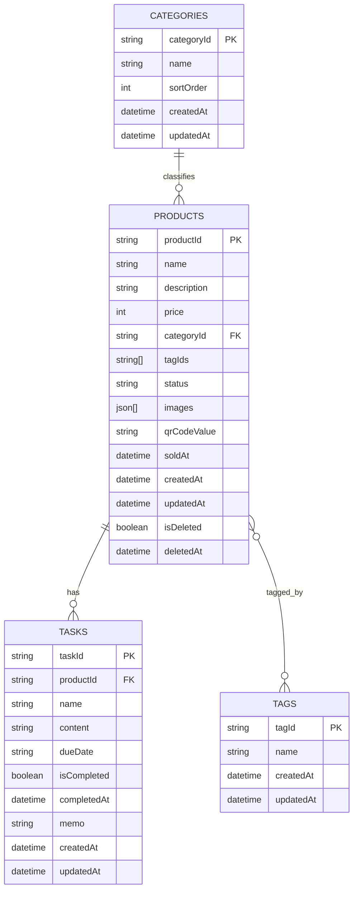

# ハンドメイド在庫・販売管理アプリ データ設計書

## 1. 目的

本書は、要件定義書、基本設計書、詳細設計書、API仕様書をもとに、ハンドメイド在庫・販売管理アプリのMVPにおけるデータ設計を定義するものである。  
主に以下を明確化する。

- 論理データモデル
- Firestore コレクション設計
- 各データの保存項目と制約
- 画像メタ情報と Cloud Storage 保存方針
- インデックス方針
- データ整合性ルール
- 派生データと非永続項目の扱い

本書は永続化対象データの設計書であり、画面挙動、API入出力、例外処理、詳細な業務フローは画面設計書・詳細設計書・API仕様書で補完する。

---

## 2. 対象範囲

MVPで扱う永続化対象は以下とする。

- 商品
- 商品画像メタ情報
- タスク
- カテゴリ
- タグ
- 商品ID採番カウンタ
- 主要操作ログ

対象外:

- 複数ユーザー管理用データ
- 顧客データ
- 決済データ
- 配送データ
- 会計データ
- 外部EC連携データ
- ステータス変更履歴の本格管理
- 売上集計の履歴データ

---

## 3. データ設計方針

### 3.1 基本方針

- データベースは Firestore を採用する
- 商品画像の実ファイルは Cloud Storage に保存する
- 商品は一点物として扱い、数量概念は持たない
- 商品の現在状態を正として保持し、MVPでは履歴管理を持たない
- 商品は論理削除、タスク・カテゴリ・タグは物理削除とする
- 画像URLは永続化せず、取得API応答時に期限付きURLとして生成する

### 3.2 命名・ID方針

| 対象 | 形式 | 例 | 備考 |
|---|---|---|---|
| 商品ID | `HM-` + 6桁連番 | `HM-000001` | 業務ID。再利用しない |
| カテゴリID | `cat_` + 任意識別子 | `cat_001` | 内部ID |
| タグID | `tag_` + 任意識別子 | `tag_001` | 内部ID |
| タスクID | `task_` + 任意識別子 | `task_001` | 内部ID |
| 画像ID | `img_` + 任意識別子 | `img_001` | 商品内一意 |
| カウンタキー | 固定文字列 | `product` | 採番用途 |
| ログID | 任意一意ID | `log_xxxxxx` | 自動生成可 |

### 3.3 日時方針

- Firestore 上は UTC Timestamp で保存する
- 画面表示時は JST（UTC+09:00）へ変換する
- 日時表示形式は `YYYY/MM/DD HH:mm` とする
- 日付表示形式は `YYYY/MM/DD` とする
- 納期は日時ではなく日付相当の値 `YYYY-MM-DD` として扱う

### 3.4 ステータス方針

永続化時は画面表示名ではなく内部コードを保持する。

| 表示名 | 内部コード |
|---|---|
| 制作前 | `beforeProduction` |
| 制作中 | `inProduction` |
| 制作済 | `completed` |
| 展示中 | `onDisplay` |
| 在庫中 | `inStock` |
| 販売済 | `sold` |

### 3.5 入力制約・正規化方針

データ設計上、文字列入力は API 仕様書および基本設計書の共通方針に合わせて正規化・保存する。

#### 3.5.1 名称系項目

対象: `products.name`, `tasks.name`, `categories.name`, `tags.name`

- 保存前に前後空白を除去する
- 前後空白除去後に空文字または空白のみとなる値は不可とする
- 改行不可
- タブ不可
- システム上の制御文字や表示崩れを招く不正文字列は入力不可または無害化して保存する
- 最大文字数は各項目定義に従う

#### 3.5.2 複数行テキスト項目

対象: `products.description`, `tasks.content`, `tasks.memo`

- 改行を許容する
- 改行コードは保存時に LF に正規化する
- システム上の制御文字や表示崩れを招く不正文字列は入力不可または無害化して保存する
- 最大文字数は各項目定義に従う

#### 3.5.3 検索キーワード

検索キーワード自体は永続化しないが、商品一覧検索やAPI入力で扱うため、データ設計上の正規化前提を以下とする。

- 検索キーワードは最大100文字とする
- 前後空白を除去する
- 連続空白を単一空白相当として扱う
- 改行不可
- タブ不可
- システム上の制御文字や表示崩れを招く不正文字列は入力不可または無害化して扱う
- 英字は大文字・小文字を区別しない
- 英数字および記号の全角/半角差は可能な範囲で吸収する
- ひらがな/カタカナは別文字として扱う
- 空文字のみはキーワード未指定として扱う

---

## 4. 論理データモデル



補足:

- 商品画像は別コレクションではなく `products.images` の埋め込み配列で保持する
- タグはマスタ `tags` と商品側参照配列 `tagIds` の組み合わせで管理する
- `TASKS.dueDate` は日付型ではなく、`YYYY-MM-DD` 形式の文字列として保持する
- `operationLogs` は業務データではなく監査・障害調査用の補助データである

---

## 5. 物理データ設計

## 5.1 コレクション一覧

| コレクション | 用途 | 主キー/識別子 | 削除方式 |
|---|---|---|---|
| `products` | 商品本体 | `productId` | 論理削除 |
| `tasks` | 商品別タスク | `taskId` | 物理削除 |
| `categories` | カテゴリマスタ | `categoryId` | 物理削除 |
| `tags` | タグマスタ | `tagId` | 物理削除 |
| `counters` | 連番管理 | `counterKey` | 物理保持 |
| `operationLogs` | 主要操作ログ | `logId` | 運用方針に従う |

## 5.2 ドキュメントID方針

| コレクション | 推奨ドキュメントパス | 備考 |
|---|---|---|
| `products` | `products/{productId}` | MVPではドキュメントIDと業務IDを一致させる |
| `tasks` | `tasks/{taskId}` | `productId` を属性として保持 |
| `categories` | `categories/{categoryId}` | 内部IDを採用 |
| `tags` | `tags/{tagId}` | 内部IDを採用 |
| `counters` | `counters/{counterKey}` | `counters/product` を使用 |
| `operationLogs` | `operationLogs/{logId}` | 自動採番またはUUID可 |

---

## 6. products 設計

## 6.1 スキーマ

| 項目 | 型 | 必須 | 説明 | 制約・補足 |
|---|---|---:|---|---|
| `productId` | string | ○ | 商品ID | `HM-000001` 形式 |
| `name` | string | ○ | 商品名 | 最大100文字、前後空白除去、空白のみ不可、改行不可、タブ不可、制御文字不可または無害化 |
| `description` | string |  | 商品説明 | 最大2000文字、改行可、LF正規化、制御文字不可または無害化 |
| `price` | number | ○ | 価格 | 0以上の整数、円単位 |
| `categoryId` | string | ○ | カテゴリ参照 | `categories.categoryId` を参照 |
| `tagIds` | array<string> |  | タグ参照一覧 | `tags.tagId` の配列 |
| `status` | string | ○ | 商品ステータス | 内部コードを保持 |
| `images` | array<object> |  | 画像メタ情報配列 | 最大10件 |
| `qrCodeValue` | string | ○ | QR識別値 | MVPでは `productId` と同値 |
| `soldAt` | timestamp\|null |  | 販売日時 | `status=sold` の場合のみ設定 |
| `createdAt` | timestamp | ○ | 作成日時 | UTC Timestamp |
| `updatedAt` | timestamp | ○ | 更新日時 | 保存成功時に更新 |
| `isDeleted` | boolean | ○ | 論理削除フラグ | 通常取得では `false` のみ対象 |
| `deletedAt` | timestamp\|null |  | 論理削除日時 | 論理削除時に設定 |

## 6.2 業務ルール

- 新規登録時に `productId` を採番する
- 新規登録時、画像は受け付けない
- 商品更新APIでは `primaryImageId` を入力として受け取り、保存時は `images[].isPrimary` に正規化する
- `primaryImageId` に該当する画像が存在する場合、指定画像のみ `isPrimary=true`、その他は `false` とする
- `primaryImageId=null` の場合、全画像を `isPrimary=false` とする
- `status=sold` で登録または更新した場合、`soldAt` 未設定時のみ現在時刻を設定する
- 既に `soldAt` が設定済みの販売済商品を再度販売済にしても上書きしない
- `sold` から他ステータスへ戻す場合は `soldAt=null` にする
- 論理削除時は `isDeleted=true`、`deletedAt=現在時刻`、`updatedAt=現在時刻` とする
- 論理削除済み商品は一覧、詳細、検索、ダッシュボード、QR更新対象から除外する

## 6.3 ドキュメント例

```json
{
  "productId": "HM-000001",
  "name": "春色ピアス",
  "description": "淡い色合いのハンドメイドピアス",
  "price": 2800,
  "categoryId": "cat_001",
  "tagIds": ["tag_001", "tag_002"],
  "status": "onDisplay",
  "images": [
    {
      "imageId": "img_001",
      "displayPath": "products/HM-000001/display/img_001.webp",
      "thumbnailPath": "products/HM-000001/thumb/img_001.webp",
      "sortOrder": 1,
      "isPrimary": true
    }
  ],
  "qrCodeValue": "HM-000001",
  "soldAt": null,
  "createdAt": "2026-03-17T10:00:00Z",
  "updatedAt": "2026-03-17T10:00:00Z",
  "isDeleted": false,
  "deletedAt": null
}
```

## 6.4 派生・非永続項目

以下はレスポンス生成時または画面表示時に派生する項目であり、永続保存しない。

| 項目 | 用途 | 生成元 |
|---|---|---|
| `categoryName` | 商品詳細・一覧表示 | `categories.name` |
| `tagNames` | 商品詳細・検索表示 | `tags.name` |
| `displayUrl` | 商品詳細画像表示 | `images.displayPath` から生成 |
| `thumbnailUrl` | 一覧・詳細サムネイル表示 | `images.thumbnailPath` から生成 |
| `urlExpiresAt` | 期限付きURL失効管理 | URL生成時刻 + 既定60分 |
| `tasksSummary` | 商品詳細の関連タスク概要 | `tasks` 集計 |

---

## 7. images 埋め込みオブジェクト設計

## 7.1 スキーマ

| 項目 | 型 | 必須 | 説明 | 制約・補足 |
|---|---|---:|---|---|
| `imageId` | string | ○ | 商品内画像ID | 商品内で一意 |
| `displayPath` | string | ○ | 表示用画像保存パス | Cloud Storage パス |
| `thumbnailPath` | string | ○ | サムネイル保存パス | Cloud Storage パス |
| `sortOrder` | number | ○ | 表示順 | 1開始の連番 |
| `isPrimary` | boolean | ○ | 代表画像フラグ | 明示設定が無い場合は `sortOrder` 最小を代表扱い |

## 7.2 保存ルール

- 1商品あたり最大10枚まで保存する
- 受け付け形式は JPEG / PNG / WebP とする
- 1ファイル10MB以下とする
- 長辺2000px超は縮小保存する
- 表示用画像とサムネイル画像を生成する
- 元画像は保持しない
- `sortOrder` は登録順で採番する
- 画像削除後は `sortOrder` を詰め直す
- 代表画像削除時、残画像があれば `sortOrder` 最小画像を代表扱いとする
- 画像0件の場合は代表画像未設定状態とする

## 7.3 Storage パス方針

| 種別 | 保存先例 |
|---|---|
| 表示用画像 | `products/{productId}/display/{imageId}.webp` |
| サムネイル | `products/{productId}/thumb/{imageId}.webp` |

## 7.4 非永続URL方針

- `displayUrl` / `thumbnailUrl` は保存しない
- 取得API応答時に期限付きURLとして生成する
- 既定有効期限は60分とする
- URL失効後は対象取得APIを再実行して再取得する

## 7.5 画像メタ情報例

```json
{
  "imageId": "img_001",
  "displayPath": "products/HM-000001/display/img_001.webp",
  "thumbnailPath": "products/HM-000001/thumb/img_001.webp",
  "sortOrder": 1,
  "isPrimary": true
}
```

---

## 8. tasks 設計

## 8.1 スキーマ

| 項目 | 型 | 必須 | 説明 | 制約・補足 |
|---|---|---:|---|---|
| `taskId` | string | ○ | タスクID | 内部ID |
| `productId` | string | ○ | 対象商品ID | `products.productId` 参照 |
| `name` | string | ○ | タスク名 | 最大100文字、前後空白除去、空白のみ不可、改行不可、タブ不可、制御文字不可または無害化 |
| `content` | string |  | タスク内容 | 最大2000文字、改行可、LF正規化、制御文字不可または無害化 |
| `dueDate` | string\|null |  | 納期 | `YYYY-MM-DD` |
| `isCompleted` | boolean | ○ | 完了フラグ | 初期値 `false` |
| `completedAt` | timestamp\|null |  | 完了日時 | 完了時のみ設定 |
| `memo` | string |  | メモ | 最大1000文字、改行可、LF正規化、制御文字不可または無害化 |
| `createdAt` | timestamp | ○ | 作成日時 | UTC Timestamp |
| `updatedAt` | timestamp | ○ | 更新日時 | 保存成功時に更新 |

## 8.2 業務ルール

- タスクは商品単位で複数登録できる
- 初期値は `isCompleted=false` とする
- `false -> true` の切替時に `completedAt=現在時刻` を設定する
- `true -> false` の切替時に `completedAt=null` とする
- 納期未設定は許容する
- タスク削除は物理削除とし、削除フラグは持たない
- 論理削除済み商品に紐づくタスクは保持するが、通常APIでは参照不可とする

## 8.3 ドキュメント例

```json
{
  "taskId": "task_001",
  "productId": "HM-000001",
  "name": "台紙を準備する",
  "content": "イベント用の台紙を作成",
  "dueDate": "2026-03-20",
  "isCompleted": false,
  "completedAt": null,
  "memo": "ラッピングも要確認",
  "createdAt": "2026-03-17T10:00:00Z",
  "updatedAt": "2026-03-17T10:00:00Z"
}
```

---

## 9. categories 設計

## 9.1 スキーマ

| 項目 | 型 | 必須 | 説明 | 制約・補足 |
|---|---|---:|---|---|
| `categoryId` | string | ○ | カテゴリID | 内部ID |
| `name` | string | ○ | カテゴリ名 | 最大50文字、前後空白除去、一意、空白のみ不可、改行不可、タブ不可、制御文字不可または無害化 |
| `sortOrder` | number | ○ | 表示順 | 未指定時は末尾採番 |
| `createdAt` | timestamp | ○ | 作成日時 | UTC Timestamp |
| `updatedAt` | timestamp | ○ | 更新日時 | 保存成功時に更新 |

## 9.2 業務ルール

- カテゴリ名は前後空白除去後の値で比較・保存する
- 同名カテゴリは登録・更新不可とする
- 未使用カテゴリのみ削除可能とする
- 未使用判定は、論理削除されていない商品から参照されていないこととする
- 削除は物理削除とする

## 9.3 ドキュメント例

```json
{
  "categoryId": "cat_001",
  "name": "ピアス",
  "sortOrder": 10,
  "createdAt": "2026-03-17T10:00:00Z",
  "updatedAt": "2026-03-17T10:00:00Z"
}
```

## 9.4 非永続項目

以下はAPI応答時の派生値であり、永続保存しない。

| 項目 | 説明 |
|---|---|
| `usedProductCount` | 論理削除されていない商品からの参照件数 |
| `isInUse` | `usedProductCount > 0` |

---

## 10. tags 設計

## 10.1 スキーマ

| 項目 | 型 | 必須 | 説明 | 制約・補足 |
|---|---|---:|---|---|
| `tagId` | string | ○ | タグID | 内部ID |
| `name` | string | ○ | タグ名 | 最大50文字、前後空白除去、一意、空白のみ不可、改行不可、タブ不可、制御文字不可または無害化 |
| `createdAt` | timestamp | ○ | 作成日時 | UTC Timestamp |
| `updatedAt` | timestamp | ○ | 更新日時 | 保存成功時に更新 |

## 10.2 業務ルール

- タグ名は前後空白除去後の値で比較・保存する
- 同名タグは登録・更新不可とする
- 未使用タグのみ削除可能とする
- 未使用判定は、論理削除されていない商品から参照されていないこととする
- 削除は物理削除とする

## 10.3 ドキュメント例

```json
{
  "tagId": "tag_001",
  "name": "春",
  "createdAt": "2026-03-17T10:00:00Z",
  "updatedAt": "2026-03-17T10:00:00Z"
}
```

## 10.4 非永続項目

| 項目 | 説明 |
|---|---|
| `usedProductCount` | 論理削除されていない商品からの参照件数 |
| `isInUse` | `usedProductCount > 0` |

---

## 11. counters 設計

## 11.1 目的

商品IDの採番を安全に行うための連番管理データを保持する。

## 11.2 スキーマ

| 項目 | 型 | 必須 | 説明 |
|---|---|---:|---|
| `counterKey` | string | ○ | カウンタ識別子 |
| `currentValue` | number | ○ | 現在の採番値 |
| `updatedAt` | timestamp |  | 最終更新日時 |

## 11.3 ドキュメント例

パス: `counters/product`

```json
{
  "counterKey": "product",
  "currentValue": 1,
  "updatedAt": "2026-03-17T10:00:00Z"
}
```

## 11.4 業務ルール

- 商品新規登録時にトランザクションで `currentValue` をインクリメントする
- 採番結果を `HM-000001` 形式へ整形して `productId` とする
- 論理削除済み商品であっても採番済みIDは再利用しない

---

## 12. operationLogs 設計

## 12.1 目的

MVPで定義する主要操作および主要エラーを記録し、障害調査・監査・運用確認に利用する。

## 12.2 スキーマ

| 項目 | 型 | 必須 | 説明 |
|---|---|---:|---|
| `logId` | string | ○ | ログID |
| `eventType` | string | ○ | イベント種別 |
| `targetId` | string\|null |  | 対象ID |
| `summary` | string | ○ | 概要 |
| `actorUid` | string\|null |  | 実行者UID |
| `createdAt` | timestamp | ○ | 記録日時 |
| `detail` | object\|null |  | 詳細情報 |

## 12.3 MVP対象イベント種別

| eventType | 内容 |
|---|---|
| `LOGIN` | ログイン |
| `PRODUCT_UPDATED` | 商品更新 |
| `PRODUCT_DELETED` | 商品論理削除 |
| `QR_SOLD` | QR販売済更新 |
| `ERROR` | 主要エラー |

補足:

- `operationLogs` のMVP対象は詳細設計書・テスト設計書で明示されたイベントに合わせる
- `PRODUCT_CREATED`、`TASK_UPDATED` は将来拡張候補とし、現時点のMVP必須対象には含めない

## 12.4 ドキュメント例

```json
{
  "logId": "log_001",
  "eventType": "PRODUCT_UPDATED",
  "targetId": "HM-000001",
  "summary": "商品を更新しました",
  "actorUid": "firebase_uid_xxx",
  "createdAt": "2026-03-20T08:40:00Z",
  "detail": {
    "changedFields": ["name", "price", "status"]
  }
}
```

---

## 13. データ整合性ルール

## 13.1 参照整合性

| 対象 | ルール |
|---|---|
| `products.categoryId` | 存在するカテゴリIDのみ保存可 |
| `products.tagIds` | 存在するタグIDのみ保存可 |
| `tasks.productId` | 存在し、かつ論理削除されていない商品への新規登録のみ可 |
| `images.imageId` | 対象商品の `images` 配列内で一意 |

## 13.2 状態整合性

| 項目 | ルール |
|---|---|
| `soldAt` | `status=sold` のときのみ設定、それ以外は `null` |
| `completedAt` | `isCompleted=true` のときのみ設定、それ以外は `null` |
| `deletedAt` | `isDeleted=true` のときのみ設定、それ以外は `null` |
| `isPrimary` | 明示設定があれば1件のみ `true` |
| `sortOrder` | 画像配列内で 1 開始の重複なし連番 |

## 13.3 論理削除時の扱い

- 商品本体は保持する
- 画像メタ情報は保持する
- 関連タスクは保持する
- ただし通常画面および通常APIからは参照不可とする
- ダッシュボード集計、検索、QR利用対象から除外する
- カテゴリ・タグの使用中判定には含めない

---

## 14. 非永続データ・API入出力専用項目

## 14.1 商品系

| 項目 | 保存有無 | 説明 |
|---|---|---|
| `displayUrl` | 保存しない | 画像表示用の期限付きURL |
| `thumbnailUrl` | 保存しない | サムネイル表示用の期限付きURL |
| `urlExpiresAt` | 保存しない | URL失効時刻 |
| `categoryName` | 保存しない | カテゴリ名称解決結果 |
| `tagNames` | 保存しない | タグ名称解決結果 |
| `tasksSummary` | 保存しない | 関連タスク件数集計 |
| `primaryImageId` | 保存しない | API入力時の代表画像指定。保存時は `images[].isPrimary` に正規化 |

## 14.2 マスタ系

| 項目 | 保存有無 | 説明 |
|---|---|---|
| `usedProductCount` | 保存しない | 使用中件数 |
| `isInUse` | 保存しない | 使用中判定 |

## 14.3 ダッシュボード系

| 項目 | 保存有無 | 説明 |
|---|---|---|
| `statusCounts` | 保存しない | 商品ステータス集計 |
| `soldCount` | 保存しない | 販売済件数 |
| `openTaskCount` | 保存しない | 未完了タスク件数 |
| `dueSoonTasks` | 保存しない | 納期近いタスク一覧 |
| `recentProducts` | 保存しない | 最近更新商品一覧 |

## 14.4 QR読取結果系

| 項目 | 保存有無 | 説明 |
|---|---|---|
| `canSell` | 保存しない | QR読取結果としての販売済更新可否 |
| `reasonCode` | 保存しない | 更新可否の理由コード |
| `message` | 保存しない | 画面表示用メッセージ |

---

## 15. インデックス設計

## 15.1 products

| インデックス | 用途 |
|---|---|
| `isDeleted + updatedAt` | 一覧初期表示 |
| `isDeleted + status + updatedAt` | ステータス絞り込み |
| `isDeleted + categoryId + updatedAt` | カテゴリ絞り込み |
| `isDeleted + categoryId + status + updatedAt` | カテゴリ+ステータス |
| `isDeleted + tagIds(array-contains) + updatedAt` | タグ絞り込み |
| `isDeleted + tagIds(array-contains) + status + updatedAt` | タグ+ステータス |
| `isDeleted + categoryId + tagIds(array-contains) + updatedAt` | カテゴリ+タグ |
| `isDeleted + categoryId + tagIds(array-contains) + status + updatedAt` | カテゴリ+タグ+ステータス |

補足:

- 商品一覧ではカテゴリ、タグ、ステータスの組み合わせ絞り込みを先行適用する
- 並び順の既定が `updatedAt` 降順のため、インデックスに `updatedAt` を含める
- キーワード検索はAPI後段フィルタで実施し、全文検索エンジンはMVP対象外とする

## 15.2 tasks

| インデックス | 用途 |
|---|---|
| `productId + isCompleted + dueDate` | 商品別タスク一覧 |
| `isCompleted + dueDate` | ダッシュボードの納期近いタスク |

## 15.3 categories / tags

| 対象 | 用途 |
|---|---|
| `categories.name` | 一意確認 |
| `tags.name` | 一意確認 |

---

## 16. 検索・集計観点での補足

### 16.1 商品一覧検索

- 検索対象は `name`、`description`、`productId`、`categoryName`、`tagNames`
- Firestore では絞り込み可能条件を先行適用する
- キーワード検索は API 側で正規化後に部分一致判定する
- 検索キーワードは最大100文字とし、前後空白除去、連続空白単一化、改行不可、タブ不可、制御文字不可または無害化を適用する
- 正規化では前後空白除去、連続空白単一化、英字小文字化、全半角差吸収を行う

### 16.2 ダッシュボード集計

- 論理削除済み商品は除外する
- 論理削除済み商品に紐づくタスクも除外する
- 納期が近いタスクは当日を含む7日以内の未完了タスクとする
- 最近更新商品は更新日時降順で最大5件とする

---

## 17. 運用・保守上の補足

### 17.1 バックアップ観点

- Firestore と Cloud Storage のクラウド基盤側保全を前提とする
- 誤削除や障害時の復旧方法は運用手順で別途定義する
- 将来的なエクスポート機能は拡張候補とする

### 17.2 将来拡張候補

- ステータス変更履歴コレクション追加
- 売上管理用データ追加
- 顧客情報コレクション追加
- 外部EC連携用マッピングデータ追加
- データエクスポート機能追加

---

## 18. 付録

## 18.1 データ項目サマリ

| エンティティ | 主キー | 主な特徴 |
|---|---|---|
| Product | `productId` | 一点物の商品本体。論理削除あり |
| ProductImage | `imageId` | `products.images` の埋め込み配列 |
| Task | `taskId` | 商品別タスク。物理削除 |
| Category | `categoryId` | 1商品に1件設定する分類 |
| Tag | `tagId` | 商品に複数設定可能 |
| Counter | `counterKey` | 商品ID採番用 |
| OperationLog | `logId` | 主要操作・主要エラー記録 |

## 18.2 永続化 / 非永続化の整理

| 項目種別 | 保存対象 |
|---|---|
| 商品・タスク・カテゴリ・タグの本体項目 | 永続化する |
| 画像の Storage パス | 永続化する |
| 画像の表示用URL | 永続化しない |
| 代表画像指定用 `primaryImageId` | 永続化しない |
| 画面表示用名称解決結果 | 永続化しない |
| 件数集計・使用中判定 | 永続化しない |
| QR読取結果の可否判定・メッセージ | 永続化しない |
