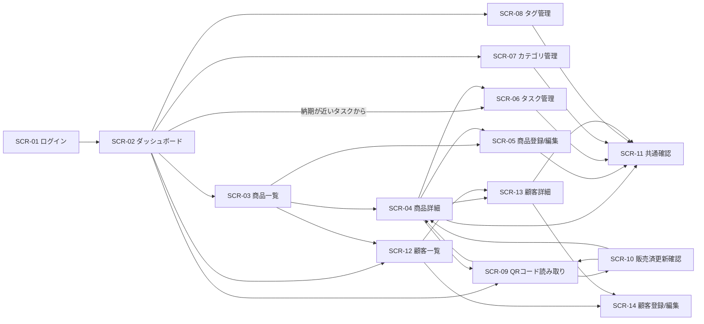

# ハンドメイド在庫・販売管理アプリ 画面設計書

## 1. 目的

本書は、要件定義書および基本設計書をもとに、ハンドメイド在庫・販売管理アプリのMVPにおける画面仕様を定義するものである。  
主に以下を明確化する。

- 画面一覧
- 画面遷移
- 各画面の目的
- レイアウト方針
- 表示項目・入力項目
- 主要操作
- 画面単位の入力制御
- エラー・空状態・確認ダイアログの扱い

本書は画面レベルの設計書であり、APIの詳細入出力、コンポーネント実装仕様、メッセージコード定義などは詳細設計で補完する。

---

## 2. 対象範囲

MVPで対象とする画面は以下とする。

| 画面ID | 画面名 |
|---|---|
| SCR-01 | ログイン画面 |
| SCR-02 | ダッシュボード画面 |
| SCR-03 | 商品一覧画面 |
| SCR-04 | 商品詳細画面 |
| SCR-05 | 商品登録/編集画面 |
| SCR-06 | タスク管理画面 |
| SCR-07 | カテゴリ管理画面 |
| SCR-08 | タグ管理画面 |
| SCR-09 | QRコード読み取り画面 |
| SCR-10 | 販売済更新確認ダイアログ |
| SCR-11 | 共通確認ダイアログ |
| SCR-12 | 顧客一覧画面 |
| SCR-13 | 顧客詳細画面 |
| SCR-14 | 顧客登録/編集画面 |

---

## 3. 画面設計方針

### 3.1 モバイルファースト方針

- 主利用端末はスマートフォンとする
- 片手操作しやすいよう、主要操作ボタンは画面上部または下部の押しやすい位置に配置する
- 屋外や展示会場でも視認しやすいよう、文字サイズ・余白・コントラストを確保する
- PCではレスポンシブ対応により一覧性を高める
- スマートフォンとPCで機能差は設けない

### 3.2 共通レイアウト方針

#### 認証前画面
- ログイン画面は単独レイアウトとし、不要なナビゲーションは表示しない

#### 認証後画面
- 共通ヘッダを表示する
- 主要画面への導線として、モバイルでは下部ナビゲーション、PCでは上部または左ナビゲーションを表示する
- 共通ヘッダまたはメニューからログアウト可能とする

#### 共通ナビゲーション候補
- ダッシュボード
- 商品一覧
- 顧客一覧
- QR読み取り
- カテゴリ管理
- タグ管理

### 3.3 共通表示ルール

#### 日時・日付表示
- 日時: `YYYY/MM/DD HH:mm`
- 日付: `YYYY/MM/DD`
- 表示時は日本時間（JST / UTC+09:00）とする

#### ステータス表示
商品ステータスは以下をバッジ表示する。

- 制作前
- 制作中
- 制作済
- 展示中
- 在庫中
- 販売済

#### 価格表示
- 円単位の整数で表示する
- 表示例: `2,800円`

#### プレースホルダー
- 商品画像未登録時はプレースホルダー画像を表示する

### 3.4 共通画面状態

| 状態 | 表示方針 | 主な対象画面 |
|---|---|---|
| 読み込み中 | スピナーまたはスケルトンを表示 | 一覧、詳細、ダッシュボード、管理画面 |
| 0件 | 対象なしメッセージを表示 | 一覧、タスク、カテゴリ、タグ |
| 集計0件 | 件数 `0` を表示 | ダッシュボード |
| 通信失敗 | エラーメッセージと再試行ボタンを表示 | 全保護画面 |
| 認証切れ（401） | 「セッションが切れました。再度ログインしてください。」表示後にログイン画面へ遷移 | 全保護画面 |
| 利用不可（403） | 「この操作は実行できません。」表示後にログイン画面へ遷移 | 全保護画面 |

### 3.5 共通バリデーション方針

- フロントで入力形式の一次チェックを行う
- API側で最終バリデーションを行う
- エラーメッセージは入力欄の近傍または画面上部に表示する
- 単一行項目は改行不可とする
- 前後空白除去対象項目は保存前にトリムする

### 3.6 共通確認方針

以下の操作では確認ダイアログを表示する。

- 商品削除
- タスク削除
- カテゴリ削除
- タグ削除
- 販売済から他ステータスへの戻し
- QR読み取り後の販売済更新確定
- 顧客アーカイブ

---

## 4. 画面遷移

補足:
- SCR-10 と SCR-11 はダイアログとして表示する
- 実装上はモーダルまたはボトムシートのいずれでもよいが、モバイルでの視認性と誤操作防止を優先する

---

## 5. 画面一覧

| 画面ID | 画面名 | 主目的 | 主利用端末 |
|---|---|---|---|
| SCR-01 | ログイン画面 | 認証 | スマートフォン / PC |
| SCR-02 | ダッシュボード画面 | 状況俯瞰 | スマートフォン / PC |
| SCR-03 | 商品一覧画面 | 商品検索・絞り込み・一覧表示 | スマートフォン / PC |
| SCR-04 | 商品詳細画面 | 商品詳細確認・QR表示・QR読み取り導線 | スマートフォン / PC |
| SCR-05 | 商品登録/編集画面 | 商品登録・更新 | スマートフォン / PC |
| SCR-06 | タスク管理画面 | 商品別タスク管理 | スマートフォン / PC |
| SCR-07 | カテゴリ管理画面 | カテゴリ管理 | スマートフォン / PC |
| SCR-08 | タグ管理画面 | タグ管理 | スマートフォン / PC |
| SCR-09 | QRコード読み取り画面 | QR読取・商品特定 | スマートフォン中心 |
| SCR-10 | 販売済更新確認ダイアログ | QR販売確定 | スマートフォン中心 |
| SCR-11 | 共通確認ダイアログ | 削除・状態戻し確認 | スマートフォン / PC |
| SCR-12 | 顧客一覧画面 | 顧客検索・最終購入情報確認 | スマートフォン / PC |
| SCR-13 | 顧客詳細画面 | 顧客情報・購入商品一覧確認 | スマートフォン / PC |
| SCR-14 | 顧客登録/編集画面 | 顧客登録・更新 | スマートフォン / PC |

---

## 6. 画面別仕様

## 6.1 SCR-01 ログイン画面

### 6.1.1 目的
利用者本人の認証を行う。

### 6.1.2 遷移
- 遷移元: なし
- 遷移先:
  - 認証成功かつ `POST /api/auth/login-record` 記録成功: SCR-02 ダッシュボード画面
  - パスワード再設定導線: ログイン画面内の再設定ダイアログ

### 6.1.3 レイアウト
- 画面中央にログインフォームを配置
- 上部にアプリ名を表示
- 下部にパスワード再設定導線を表示

### 6.1.4 項目一覧

| No | 項目名 | 種別 | 必須 | 説明 |
|---|---|---|---|---|
| 1 | メールアドレス | テキスト入力 | ○ | ログイン用メールアドレス |
| 2 | パスワード | パスワード入力 | ○ | ログイン用パスワード |
| 3 | ログインボタン | ボタン | - | 認証実行。入力妥当時のみ活性、認証中は押下不可 |
| 4 | パスワード再設定リンク | リンク | - | 再設定導線 |
| 5 | エラーメッセージ | メッセージ | - | 認証失敗時に表示 |

### 6.1.5 初期表示
- 入力欄は空
- エラーメッセージは非表示
- ログインボタンは入力妥当時のみ活性化する

### 6.1.6 操作
- ログインボタン押下で認証実行
- Enterキーでもログイン可能とする
- 認証成功後は ID トークンを取得し、`POST /api/auth/login-record` を1回実行する
- `POST /api/auth/login-record` の記録成功後にダッシュボードへ遷移する
- `POST /api/auth/login-record` の記録失敗時は共通エラーを表示し、再試行可能状態へ戻す
- 認証中はログインボタンを押下不可とし、二重送信を防止する
- 認証失敗時はエラーメッセージを表示し、再操作可能状態へ戻す
- パスワード再設定リンク押下で再設定ダイアログを表示する
- メールアドレス入力済みの場合は、その値を再設定ダイアログの初期値として利用する
- 再設定メールは Firebase Authentication の標準機能で送信する
- 再設定メール送信後は、成功または失敗メッセージを表示する

### 6.1.7 バリデーション
- メールアドレス未入力: エラー
- パスワード未入力: エラー
- メールアドレス形式不正: エラー

### 6.1.8 メッセージ例
- 「メールアドレスを入力してください」
- 「パスワードを入力してください」
- 「メールアドレスまたはパスワードが正しくありません」
- 「セッションが切れました。再度ログインしてください。」
- 「この操作は実行できません。」

---

## 6.2 SCR-02 ダッシュボード画面

### 6.2.1 目的
商品とタスクの全体状況を短時間で把握する。

### 6.2.2 遷移
- 遷移元:
  - SCR-01 ログイン画面
  - 共通ナビゲーション
- 遷移先:
  - SCR-03 商品一覧画面
  - SCR-09 QRコード読み取り画面
  - SCR-12 顧客一覧画面
  - SCR-07 カテゴリ管理画面
  - SCR-08 タグ管理画面
  - SCR-04 商品詳細画面（最近更新商品から）
  - SCR-06 タスク管理画面（納期が近いタスクから、対象商品コンテキスト付き）

### 6.2.3 レイアウト
- 上部: ヘッダ、ログアウト導線
- 中段: 件数カード群
- 下段: 納期が近いタスク一覧、最近更新商品一覧
- モバイルでは縦積み、PCでは2カラム以上を許容

### 6.2.4 項目一覧

| No | 項目名 | 種別 | 説明 |
|---|---|---|---|
| 1 | ステータス別件数 | カード | 制作前〜販売済の件数 |
| 2 | 販売済件数 | カード | 販売済商品の件数 |
| 3 | 未完了タスク件数 | カード | 未完了タスクの合計件数 |
| 4 | 納期が近いタスク一覧 | リスト | 当日含む7日以内の未完了タスク |
| 5 | 最近更新した商品 | リスト | 更新日時降順、最大5件 |
| 6 | 再試行ボタン | ボタン | 通信失敗時 |

### 6.2.5 初期表示
- ローディング表示後に集計結果を表示
- 集計0件の場合もカードは表示し、値は `0`

### 6.2.6 操作
- 最近更新した商品タップで商品詳細へ遷移
- 納期が近いタスク項目タップで、該当商品のSCR-06 タスク管理画面へ遷移する
- タスク管理画面では対象商品コンテキストを保持した状態で対象タスクを確認できるようにする
- 通信失敗時は再試行可能とする

### 6.2.7 表示ルール
- 論理削除済み商品は集計対象外
- 論理削除済み商品に紐づくタスクも集計対象外
- 納期未設定タスクは「納期が近いタスク一覧」の対象外
- 最近更新した商品は最大5件

### 6.2.8 空状態・エラー
- 納期が近いタスク0件: 「期限が近いタスクはありません」
- 最近更新商品0件: 「最近更新した商品はありません」
- 通信失敗: 「ダッシュボードの取得に失敗しました」

---

## 6.3 SCR-03 商品一覧画面

### 6.3.1 目的
商品を一覧で確認し、検索、絞り込み、並び替え、詳細遷移を行う。

### 6.3.2 遷移
- 遷移元:
  - SCR-02 ダッシュボード画面
  - 共通ナビゲーション
- 遷移先:
  - SCR-04 商品詳細画面
  - SCR-05 商品登録/編集画面（新規）

### 6.3.3 レイアウト
- 上部: 検索欄、フィルタ群、並び替え、販売済表示切替
- 中央: 商品カードまたは商品行一覧
- 下部: ページングUI（現在ページ表示、前へ/次へボタン）
- 右下または下部固定: 新規登録ボタン
- PCでは検索条件を横並び配置

### 6.3.4 項目一覧

| No | 項目名 | 種別 | 説明 |
|---|---|---|---|
| 1 | キーワード検索欄 | テキスト入力 | 商品名、説明、商品ID、カテゴリ名、タグ名を対象。最大100文字、改行不可 |
| 2 | カテゴリ絞り込み | セレクト | 1件選択 |
| 3 | タグ絞り込み | セレクト | 1件選択 |
| 4 | ステータス絞り込み | セレクト | 1件選択 |
| 5 | 並び替え | セレクト | 並び替えキー/順序。更新日時 / 商品名 × 昇順 / 降順 |
| 6 | 販売済表示切替 | スイッチ | 販売済商品の表示/非表示。ステータス絞り込みで「販売済」を選択時はON固定 |
| 7 | 商品一覧 | リスト | サムネイル、商品名、商品ID、ステータス、カテゴリ、更新日時 |
| 8 | 現在ページ表示 | 表示 | `1 / n` 形式または現在ページ番号を表示 |
| 9 | 前へボタン | ボタン | 前ページへ遷移。先頭ページでは非活性 |
| 10 | 次へボタン | ボタン | 次ページへ遷移。最終ページまたは `hasNext=false` 時は非活性 |
| 11 | 新規登録ボタン | ボタン | 商品登録画面へ遷移 |
| 12 | 条件クリアボタン | ボタン | 検索・絞り込み条件を初期化 |
| 13 | 再試行ボタン | ボタン | 通信失敗時 |

### 6.3.5 初期表示
- 並び順は更新日時降順
- 販売済表示切替の初期値はONとし、販売済商品を区別表示する
- 検索条件未指定
- 現在ページは1
- 取得件数は1ページあたり既定50件
- ローディング後に一覧表示

### 6.3.6 一覧表示項目
各商品行またはカードに以下を表示する。

- 商品サムネイル
- 商品名
- 商品ID
- ステータス
- カテゴリ
- 更新日時

必要に応じて以下を補助表示する。

- タグ
- 価格
- 販売済マーク

### 6.3.7 操作
- 商品行タップで商品詳細へ遷移
- 新規登録ボタン押下で商品登録画面へ遷移
- 前へ/次へボタン押下で対象ページを再取得する
- 条件変更時は一覧を再取得する
- 条件変更時はページを1に戻す
- 条件クリアで初期条件とページ1へ戻す
- 並び替え変更時は選択した並び替えキー/順序で一覧を再取得する
- ステータス絞り込みで「販売済」を選択した場合、販売済表示切替はON固定とし、内部的に販売済商品を表示対象に含める
- 0件時は条件見直し導線を表示する

### 6.3.8 検索・絞り込みルール
- キーワード検索と各絞り込み条件はAND条件
- 検索キーワードは最大100文字、改行不可とする
- 並び替えは「更新日時 / 商品名」と「昇順 / 降順」の組み合わせで指定する
- 初期値は「更新日時 / 降順」とする
- 前後空白は除去
- 連続空白は単一空白相当で扱う
- 英字の大文字・小文字は区別しない
- 英数字・記号の全角/半角差は可能な範囲で吸収
- ひらがな/カタカナは別文字として扱う
- 空文字のみは未指定として扱う
- ステータス絞り込みで「販売済」を選択中は、販売済表示切替をユーザー操作でOFFにできない

### 6.3.9 空状態・エラー
- 0件: 「条件に一致する商品はありません。検索条件を変更してください。」
- 通信失敗: 「商品一覧の取得に失敗しました」
- 再試行時は直前条件と直前ページを保持する

---

## 6.4 SCR-04 商品詳細画面

### 6.4.1 目的
商品の詳細情報、画像、関連タスク、QRコードを確認し、販売済商品の購入者情報確認や関連タスクの完了状態更新を行う。

### 6.4.2 遷移
- 遷移元:
  - SCR-03 商品一覧画面
  - SCR-02 ダッシュボード画面
  - SCR-10 販売済更新確認ダイアログ
  - SCR-13 顧客詳細画面（購入商品一覧から）
- 遷移先:
  - SCR-05 商品登録/編集画面
  - SCR-06 タスク管理画面
  - SCR-09 QRコード読み取り画面
  - SCR-11 共通確認ダイアログ
  - SCR-13 顧客詳細画面（購入者詳細導線）

### 6.4.3 レイアウト
- 上部: 商品基本情報、代表画像
- 中段: 画像一覧、カテゴリ、タグ、ステータス、販売日時、購入者情報
- 下段: 関連タスク一覧、QRコード、QR読み取りボタン、操作ボタン
- モバイルでは縦スクロール、PCでは画像エリアと情報エリアの2カラムを許容

### 6.4.4 項目一覧

| No | 項目名 | 種別 | 説明 |
|---|---|---|---|
| 1 | 商品ID | 表示 | `HM-000001` 形式 |
| 2 | 商品名 | 表示 | 商品名称 |
| 3 | 商品説明 | 表示 | 複数行表示可 |
| 4 | 価格 | 表示 | 円単位整数 |
| 5 | カテゴリ | 表示 | 1件 |
| 6 | タグ | 表示 | 複数件 |
| 7 | ステータス | 表示 | バッジ表示 |
| 8 | 販売日時 | 表示 | 販売済時のみ表示 |
| 9 | 購入者情報 | 表示 | 販売済かつ顧客紐付け済みの場合に購入者名を表示 |
| 10 | 購入者詳細導線 | ボタン/リンク | 顧客紐付け済みの場合に顧客詳細画面へ遷移 |
| 11 | 代表画像 | 画像 | 未設定時は先頭画像またはプレースホルダー |
| 12 | 画像一覧 | サムネイル一覧 | 複数画像表示 |
| 13 | 関連タスク一覧 | リスト | 未完了を優先表示し、各タスク行から完了状態を直接切り替え可能 |
| 14 | 完了済み表示切替 | スイッチ/タブ | 完了タスクの表示切替 |
| 15 | QRコード | 表示 | 商品識別用 |
| 16 | QR読み取りボタン | ボタン | QRコード読み取り画面へ遷移 |
| 17 | 編集ボタン | ボタン | 商品編集へ遷移 |
| 18 | 削除ボタン | ボタン | 商品削除確認を表示 |
| 19 | タスク管理ボタン | ボタン | タスク管理画面へ遷移 |

### 6.4.5 初期表示
- ローディング表示後に商品情報を表示
- 代表画像未設定かつ画像ありの場合は先頭画像を代表表示
- 画像未登録の場合はプレースホルダー表示
- 関連タスクは未完了のみ初期表示
- 販売済かつ `soldCustomerId` がある場合は購入者名と顧客詳細導線を表示する

### 6.4.6 操作
- QR読み取りボタン押下でQRコード読み取り画面へ遷移
- 編集ボタン押下で商品編集画面へ遷移
- 削除ボタン押下で共通確認ダイアログを表示
- タスク管理ボタン押下でタスク管理画面へ遷移
- 完了済み表示切替で完了タスク表示/非表示を切り替える
- 関連タスク上で完了状態を直接切り替えられる
- 購入者詳細導線押下で顧客詳細画面へ遷移する

### 6.4.7 表示ルール
- 論理削除済み商品は通常参照不可
- 対象商品が取得不可の場合はエラー表示と商品一覧への戻る導線を表示
- 販売日時は `status=販売済` の場合のみ表示
- 購入者情報は `status=販売済` かつ顧客紐付け済みの場合のみ表示する
- QRコードは同一商品に対して同一内容で表示

### 6.4.8 空状態・エラー
- 商品取得不可: 「対象の商品が見つかりません。」または「対象の商品はすでに利用できません。」
- 通信失敗: 「商品詳細の取得に失敗しました。再度お試しください。」
- タスク0件: 「未完了の関連タスクはありません」

---

## 6.5 SCR-05 商品登録/編集画面

### 6.5.1 目的
商品情報を登録または更新する。

### 6.5.2 遷移
- 遷移元:
  - SCR-03 商品一覧画面（新規）
  - SCR-04 商品詳細画面（編集）
- 遷移先:
  - 保存成功: SCR-04 商品詳細画面
  - キャンセル: 遷移元へ戻る
  - 販売済戻し時: SCR-11 共通確認ダイアログ

### 6.5.3 レイアウト
- 上部: 画面タイトル、新規/編集区分、保存ボタン
- 中段: 基本情報入力
- 下段: 画像登録、代表画像設定、ステータス設定
- 新規登録時は初回保存完了まで、画像登録・代表画像設定領域を非活性または非表示とする
- モバイルでは1カラム、PCではフォームと画像エリアの2カラムを許容

### 6.5.4 項目一覧

| No | 項目名 | 種別 | 必須 | 説明 |
|---|---|---|---|---|
| 1 | 商品ID | 表示 | - | 新規時は採番後に確定、編集不可 |
| 2 | 商品名 | テキスト入力 | ○ | 最大100文字 |
| 3 | 商品説明 | テキストエリア | - | 最大2,000文字 |
| 4 | 価格 | 数値入力 | ○ | 0以上の整数、円単位 |
| 5 | カテゴリ | セレクト | ○ | 1件選択 |
| 6 | タグ | 複数選択 | - | 複数設定可 |
| 7 | 商品画像 | 画像アップロード | - | 最大10枚。新規未保存時は非活性または非表示 |
| 8 | 代表画像 | ラジオ/選択 | - | 登録済み画像から選択。新規未保存時は非活性または非表示 |
| 9 | ステータス | セレクト | ○ | 1件選択 |
| 10 | 保存ボタン | ボタン | - | 登録/更新実行 |
| 11 | キャンセルボタン | ボタン | - | 前画面へ戻る |
| 12 | 入力エラー表示 | メッセージ | - | 項目ごと/画面上部表示 |

### 6.5.5 初期表示
#### 新規登録時
- 商品IDは未採番または「保存後に採番」と表示
- 入力欄は初期値を表示
- 商品画像と代表画像の操作領域は非活性または非表示とする
- 初回保存成功後は商品詳細画面へ遷移し、その後、保存済み商品として画像追加・代表画像設定を行う
- ステータスの初期値は未選択とし、利用者が必ず明示選択する

#### 編集時
- 登録済み情報を表示
- 画像、代表画像、ステータス、タグも既存値を反映

### 6.5.6 操作
- 保存ボタン押下で入力チェック後に登録/更新を実行
- 商品画像の追加、差し替え、削除を行える
  - ただし新規登録時は初回保存成功後のみ操作可能とする
- 代表画像は登録済み画像から選択する
  - ただし新規登録時は初回保存成功後のみ設定可能とする
- 販売済から他ステータスへ変更する場合は確認ダイアログを表示
- 保存成功後は商品詳細へ遷移
- 保存時に通信失敗した場合は、入力内容を保持したままエラーメッセージを表示し、再送またはキャンセルを可能とする

### 6.5.7 バリデーション
- 商品名: 必須、最大100文字、空白のみ不可、改行不可
- 商品説明: 最大2,000文字
- 価格: 必須、0以上整数、小数不可
- カテゴリ: 必須
- ステータス: 必須、初期値未選択
- 画像: JPEG / PNG / WebP、10MB以下、最大10枚

### 6.5.8 業務ルール
- 販売済へ変更した際、販売日時未設定であれば現在日時を設定
- 既に販売済の商品に再度販売済を設定しても販売日時は上書きしない
- 販売済から他ステータスへ戻した場合は販売日時を未設定に戻す
- 代表画像削除時、残画像があれば先頭画像を代表扱いとする
- 新規登録では画像アップロードおよび代表画像設定を受け付けず、初回保存成功後に操作可能とする

### 6.5.9 メッセージ例
- 「商品名を入力してください」
- 「価格は0以上の整数で入力してください」
- 「カテゴリを選択してください」
- 「画像は10枚まで登録できます」
- 「対応していない画像形式です」
- 「販売済からステータスを戻すと販売日時が解除されます。よろしいですか？」
- 「保存に失敗しました。入力内容を保持したまま再度お試しください。」

---

## 6.6 SCR-06 タスク管理画面

### 6.6.1 目的
商品ごとのタスクを登録、編集、削除し、完了状態を管理する。

### 6.6.2 遷移
- 遷移元:
  - SCR-04 商品詳細画面
  - SCR-02 ダッシュボード画面（納期が近いタスク一覧から、対象商品コンテキスト付き）
- 遷移先:
  - SCR-04 商品詳細画面
  - SCR-11 共通確認ダイアログ

### 6.6.3 レイアウト
- 上部: 対象商品名、戻る導線、追加ボタン
- 中段: タスク一覧
- 下段: タスク入力フォームまたは編集フォーム
- モバイルでは一覧とフォームを縦配置、PCでは左右分割も許容

### 6.6.4 項目一覧

| No | 項目名 | 種別 | 必須 | 説明 |
|---|---|---|---|---|
| 1 | タスク一覧 | リスト | - | タスク名、納期、完了状態、内容、メモ |
| 2 | タスク名 | テキスト入力 | ○ | 最大100文字 |
| 3 | タスク内容 | テキストエリア | - | 最大2,000文字 |
| 4 | 納期 | 日付入力 | - | `YYYY/MM/DD` 表示 |
| 5 | メモ | テキストエリア | - | 最大1,000文字 |
| 6 | 完了チェック | チェックボックス/スイッチ | - | 完了/未完了切替 |
| 7 | 追加ボタン | ボタン | - | 新規タスク登録 |
| 8 | 編集ボタン | ボタン | - | 既存タスク編集 |
| 9 | 削除ボタン | ボタン | - | 削除確認表示 |
| 10 | 完了済み表示切替 | スイッチ/タブ | - | 完了済みタスクの表示切替 |

### 6.6.5 初期表示
- 未完了タスクのみ表示
- 並び順は納期昇順、納期未設定は後ろ
- 完了済み表示切替はOFF

### 6.6.6 操作
- 追加ボタン押下で新規タスクフォーム表示
- 編集ボタン押下で対象タスクをフォームに表示
- 完了チェック変更で完了状態を更新
- 削除ボタン押下で共通確認ダイアログを表示

### 6.6.7 バリデーション
- タスク名: 必須、最大100文字、空白のみ不可、改行不可
- タスク内容: 最大2,000文字
- メモ: 最大1,000文字

### 6.6.8 業務ルール
- 完了時は完了日時を設定
- 未完了へ戻した場合は完了日時を解除
- 削除は物理削除

### 6.6.9 空状態・エラー
- 0件: 「未完了のタスクはありません」
- 通信失敗: 「タスク情報の取得に失敗しました」

---

## 6.7 SCR-07 カテゴリ管理画面

### 6.7.1 目的
カテゴリの追加、編集、削除を行う。

### 6.7.2 遷移
- 遷移元:
  - SCR-02 ダッシュボード画面
  - 共通ナビゲーション
- 遷移先:
  - SCR-11 共通確認ダイアログ

### 6.7.3 レイアウト
- 上部: 画面タイトル、追加/編集兼用フォーム
- 中段: カテゴリ一覧
- 各行に編集、削除導線を配置
- 編集モード時は対象カテゴリの内容をフォームに反映し、登録ボタンの代わりに更新ボタンとキャンセルボタンを表示する

### 6.7.4 項目一覧

| No | 項目名 | 種別 | 必須 | 説明 |
|---|---|---|---|---|
| 1 | カテゴリ名入力 | テキスト入力 | ○ | 最大50文字 |
| 2 | 表示順入力 | 数値入力 | - | 任意。未指定時は末尾扱い |
| 3 | 登録ボタン | ボタン | - | 新規登録時に表示 |
| 4 | 更新ボタン | ボタン | - | 編集確定時に表示 |
| 5 | キャンセルボタン | ボタン | - | 編集モード解除、入力内容を初期化 |
| 6 | カテゴリ一覧 | リスト | - | 名称、表示順、更新日時、使用状態（使用中/未使用、必要に応じて参照件数） |
| 7 | 編集ボタン | ボタン | - | 編集モードへ |
| 8 | 削除ボタン | ボタン | - | 未使用時のみ活性。削除確認を表示 |

### 6.7.5 初期表示
- カテゴリ一覧を取得して表示
- カテゴリ名入力欄は空
- 表示順入力欄は空
- 初期状態は新規登録モードとし、登録ボタンを表示する
- 更新ボタンとキャンセルボタンは非表示とする

### 6.7.6 操作
- 登録ボタン押下でカテゴリ追加
- 編集ボタン押下で対象カテゴリを編集モードにし、カテゴリ名と表示順をフォームへ反映する
- 編集モード中は登録ボタンを非表示または非活性とし、更新ボタンとキャンセルボタンを表示する
- 更新ボタン押下でカテゴリ更新を実行し、成功後は新規登録モードへ戻す
- キャンセルボタン押下で編集モードを解除し、入力内容を初期化して新規登録モードへ戻す
- 削除ボタンは使用状態に応じて活性/非活性を切り替える
- 削除ボタン押下で共通確認ダイアログを表示

### 6.7.7 バリデーション
- カテゴリ名: 必須、最大50文字、空白のみ不可、改行不可
- 表示順: 任意、数値入力、未指定可
- 保存時に前後空白を除去
- 同名カテゴリは登録・更新不可

### 6.7.8 業務ルール
- 未使用カテゴリのみ削除可能
- 使用状態は `usedProductCount / isInUse` に基づいて判定する
- 未使用判定は、論理削除されていない商品から参照されていないこと

### 6.7.9 メッセージ例
- 「カテゴリ名を入力してください」
- 「同名のカテゴリは登録できません」
- 「使用中のカテゴリは削除できません」

---

## 6.8 SCR-08 タグ管理画面

### 6.8.1 目的
タグの追加、編集、削除を行う。

### 6.8.2 遷移
- 遷移元:
  - SCR-02 ダッシュボード画面
  - 共通ナビゲーション
- 遷移先:
  - SCR-11 共通確認ダイアログ

### 6.8.3 レイアウト
- 上部: 画面タイトル、追加/編集兼用フォーム
- 中段: タグ一覧
- 各行に編集、削除導線を配置
- 編集モード時は対象タグの内容をフォームに反映し、登録ボタンの代わりに更新ボタンとキャンセルボタンを表示する

### 6.8.4 項目一覧

| No | 項目名 | 種別 | 必須 | 説明 |
|---|---|---|---|---|
| 1 | タグ名入力 | テキスト入力 | ○ | 最大50文字 |
| 2 | 登録ボタン | ボタン | - | 新規登録時に表示 |
| 3 | 更新ボタン | ボタン | - | 編集確定時に表示 |
| 4 | キャンセルボタン | ボタン | - | 編集モード解除、入力内容を初期化 |
| 5 | タグ一覧 | リスト | - | 名称、更新日時、使用状態（使用中/未使用、必要に応じて参照件数） |
| 6 | 編集ボタン | ボタン | - | 編集モードへ |
| 7 | 削除ボタン | ボタン | - | 未使用時のみ活性。削除確認を表示 |

### 6.8.5 初期表示
- タグ一覧を取得して表示
- 入力欄は空
- 初期状態は新規登録モードとし、登録ボタンを表示する
- 更新ボタンとキャンセルボタンは非表示とする

### 6.8.6 操作
- 登録ボタン押下でタグ追加
- 編集ボタン押下で対象タグを編集モードにし、タグ名をフォームへ反映する
- 編集モード中は登録ボタンを非表示または非活性とし、更新ボタンとキャンセルボタンを表示する
- 更新ボタン押下でタグ更新を実行し、成功後は新規登録モードへ戻す
- キャンセルボタン押下で編集モードを解除し、入力内容を初期化して新規登録モードへ戻す
- 削除ボタンは使用状態に応じて活性/非活性を切り替える
- 削除ボタン押下で共通確認ダイアログを表示

### 6.8.7 バリデーション
- タグ名: 必須、最大50文字、空白のみ不可、改行不可
- 保存時に前後空白を除去
- 同名タグは登録・更新不可

### 6.8.8 業務ルール
- 未使用タグのみ削除可能
- 使用状態は `usedProductCount / isInUse` に基づいて判定する
- 未使用判定は、論理削除されていない商品から参照されていないこと

### 6.8.9 メッセージ例
- 「タグ名を入力してください」
- 「同名のタグは登録できません」
- 「使用中のタグは削除できません」

---

## 6.9 SCR-09 QRコード読み取り画面

### 6.9.1 目的
商品QRコードを読み取り、販売済更新対象商品を特定する。

### 6.9.2 遷移
- 遷移元:
  - SCR-02 ダッシュボード画面
  - SCR-04 商品詳細画面
  - 共通ナビゲーション
- 遷移先:
  - SCR-10 販売済更新確認ダイアログ
  - SCR-04 商品詳細画面
  - 同画面内で再試行

### 6.9.3 レイアウト
- 上部: 画面タイトル、戻る導線
- 中央: カメラプレビュー、読取枠
- 下部: 読み取り結果、商品確認領域、購入者選択、再試行ボタン

### 6.9.4 項目一覧

| No | 項目名 | 種別 | 説明 |
|---|---|---|---|
| 1 | カメラプレビュー | カメラ表示 | QRコード読取用 |
| 2 | 読取ガイド | オーバーレイ | QR位置の目安 |
| 3 | 読取結果メッセージ | メッセージ | 成功/失敗/対象外表示 |
| 4 | 商品確認情報 | 表示 | 商品名、商品ID、ステータスなど |
| 5 | 購入者選択 | セレクト/オートコンプリート | 更新可能時のみ表示。未選択も可 |
| 6 | 販売済更新ボタン | ボタン | 更新可能時のみ表示 |
| 7 | 再試行ボタン | ボタン | 失敗時や完了後の再読取用 |

### 6.9.5 初期表示
- カメラ起動
- 読み取り待機状態
- 読取結果領域は空またはガイド文言を表示
- 購入者選択は商品特定後かつ更新可能時のみ表示する

### 6.9.6 操作
- QR読取成功時、商品特定処理を実行
- 対象商品の状態が更新可能であれば購入者選択と販売済更新ボタンを表示または活性化する
- 購入者は任意で選択でき、未選択のままでも更新可能とする
- 販売済更新ボタン押下で販売済更新確認ダイアログを表示する
- 読み取り失敗時は再試行可能
- 通信失敗時は同一画面で再試行可能

### 6.9.7 判定ルール

| 現在ステータス | 結果 |
|---|---|
| 展示中 | 販売済更新可能 |
| 在庫中 | 販売済更新可能 |
| 販売済 | 更新せず「既に販売済」表示 |
| 制作前 | 更新不可 |
| 制作中 | 更新不可 |
| 制作済 | 更新不可 |
| 論理削除済み | 無効QR扱い |
| 未登録 | エラー |

### 6.9.8 メッセージ例
- 「QRコードを読み取ってください」
- 「商品を特定しました」
- 「この商品は販売済に更新できます」
- 「この商品は既に販売済です」
- 「現在のステータスでは販売済に更新できません」
- 「無効なQRコードです」
- 「読み取りに失敗しました。再試行してください」
- 「顧客未選択のままでも販売済に更新できます」

---

## 6.10 SCR-10 販売済更新確認ダイアログ

### 6.10.1 目的
QR読み取り後の販売済更新を最終確認する。

### 6.10.2 表示契機
- SCR-09で更新可能商品を読み取り、利用者が販売済更新ボタンを押下した時

### 6.10.3 表示項目

| No | 項目名 | 説明 |
|---|---|---|
| 1 | タイトル | 販売済更新確認 |
| 2 | 商品名 | 対象商品名 |
| 3 | 商品ID | 対象商品ID |
| 4 | 現在ステータス | 展示中または在庫中 |
| 5 | 選択した購入者 | 任意。未選択の場合は「未選択」表示 |
| 6 | 実行確認文言 | 販売済へ更新する旨 |
| 7 | 確定ボタン | 販売済更新実行。送信中は押下不可 |
| 8 | キャンセルボタン | ダイアログを閉じる。送信中は押下不可 |

### 6.10.4 操作
- 確定ボタン押下で販売済更新を実行
- 送信中は確定ボタン・キャンセルボタンを押下不可とし、二重送信を防止する
- 成功時は完了メッセージを表示し、商品詳細または読取画面へ遷移/復帰
- キャンセルでダイアログを閉じ、QR読み取り画面へ戻る

### 6.10.5 業務ルール
- 販売済更新時、販売日時未設定なら現在日時を設定
- `customerId` 指定時は存在する未アーカイブ顧客のみ更新に利用する
- 既に販売済の商品には本ダイアログを表示しない

### 6.10.6 メッセージ例
- 「この商品を販売済に更新します。よろしいですか？」
- 「販売済に更新しました」
- 「販売済更新に失敗しました」
- 「選択した顧客が見つかりません。顧客一覧を確認してください」

---

## 6.11 SCR-11 共通確認ダイアログ

### 6.11.1 目的
破壊的操作または重要操作の確認を行う。

### 6.11.2 対象操作
- 商品削除
- タスク削除
- カテゴリ削除
- タグ削除
- 顧客アーカイブ
- 販売済から他ステータスへの戻し

### 6.11.3 表示項目

| No | 項目名 | 説明 |
|---|---|---|
| 1 | タイトル | 操作名に応じて切替 |
| 2 | 確認メッセージ | 対象名を含めて表示 |
| 3 | 補足メッセージ | 復元不可や販売日時解除などの注意 |
| 4 | 実行ボタン | はい / 削除する / 変更する / アーカイブする |
| 5 | キャンセルボタン | いいえ / 戻る |

### 6.11.4 文言例
#### 商品削除
- タイトル: 「商品削除確認」
- 本文: 「この商品を削除しますか？」
- 補足: 「削除した商品は通常の一覧や検索結果に表示されません」

#### タスク削除
- タイトル: 「タスク削除確認」
- 本文: 「このタスクを削除しますか？」
- 補足: 「削除したタスクは元に戻せません」

#### カテゴリ削除
- タイトル: 「カテゴリ削除確認」
- 本文: 「このカテゴリを削除しますか？」

#### タグ削除
- タイトル: 「タグ削除確認」
- 本文: 「このタグを削除しますか？」

#### 顧客アーカイブ
- タイトル: 「顧客をアーカイブしますか？」
- 本文: 「この顧客を通常一覧から非表示にしますか？」
- 補足: 「購入履歴との紐付けは保持されます」

#### 販売済からの戻し
- タイトル: 「ステータス変更確認」
- 本文: 「販売済からステータスを変更しますか？」
- 補足: 「販売日時と顧客紐付けは解除されます」

---

## 6.12 SCR-12 顧客一覧画面

### 6.12.1 目的
顧客を検索し、最終購入情報や購入回数を一覧で確認する。

### 6.12.2 遷移
- 遷移元:
  - SCR-02 ダッシュボード画面
  - SCR-03 商品一覧画面
  - 共通ナビゲーション
- 遷移先:
  - SCR-13 顧客詳細画面
  - SCR-14 顧客登録/編集画面

### 6.12.3 レイアウト
- 上部: 画面タイトル、新規登録ボタン
- 中央: 検索欄、並び順、顧客一覧
- 下部: ページングUI（現在ページ表示、前へ/次へボタン）

### 6.12.4 項目一覧
| No | 項目名 | 種別 | 説明 |
|---|---|---|---|
| 1 | キーワード | 入力 | 顧客名、SNSアカウント、メモを検索 |
| 2 | 並び順 | 選択 | 更新日時順 / 最終購入日順 / 顧客名順 |
| 3 | 顧客一覧 | 一覧 | 顧客名、最終購入日、最終購入商品、購入回数 |
| 4 | 現在ページ表示 | 表示 | `1 / n` 形式または現在ページ番号を表示 |
| 5 | 前へボタン | ボタン | 前ページがある場合のみ活性 |
| 6 | 次へボタン | ボタン | 次ページがある場合のみ活性 |
| 7 | 新規登録ボタン | ボタン | 顧客登録へ遷移 |

### 6.12.5 操作
- 初期表示時は1ページ目を表示する
- 行押下で顧客詳細へ遷移する
- 新規登録ボタンで顧客登録画面へ遷移する
- 並び順変更時は1ページ目へ戻して再検索する
- キーワード変更後に検索実行した場合は1ページ目へ戻して再検索する
- 前へボタン押下で前ページを表示する
- 次へボタン押下で次ページを表示する
- `hasNext=false` の場合、次へボタンは非活性とする
- 現在ページが1ページ目の場合、前へボタンは非活性とする
- アーカイブ済み顧客は通常表示しない

### 6.12.6 空状態・エラー
- 0件: 「条件に一致する顧客はありません。」
- 通信失敗: 「顧客一覧の取得に失敗しました」

---

## 6.13 SCR-13 顧客詳細画面

### 6.13.1 目的
顧客情報と購入商品一覧を確認する。

### 6.13.2 遷移
- 遷移元:
  - SCR-12 顧客一覧画面
  - SCR-04 商品詳細画面（購入者詳細導線）
- 遷移先:
  - SCR-14 顧客登録/編集画面
  - SCR-04 商品詳細画面（購入商品一覧から）
  - SCR-11 共通確認ダイアログ（アーカイブ）

### 6.13.3 レイアウト
- 上部: 顧客基本情報、編集ボタン
- 中段: SNSアカウント、メモ、最終購入情報
- 下段: 購入商品一覧、アーカイブボタン

### 6.13.4 項目一覧
| No | 項目名 | 種別 | 説明 |
|---|---|---|---|
| 1 | 顧客名 | 表示 | 必須表示 |
| 2 | 性別 | 表示 | 任意 |
| 3 | 年代 | 表示 | 任意 |
| 4 | 系統メモ | 表示 | 任意 |
| 5 | SNSアカウント | 一覧 | 複数表示可 |
| 6 | 顧客メモ | 表示 | 任意 |
| 7 | 最終購入情報 | 表示 | 最終購入日、最終購入商品 |
| 8 | 購入商品一覧 | 一覧 | 販売日時降順 |
| 9 | 編集ボタン | ボタン | 顧客編集へ遷移 |
| 10 | アーカイブボタン | 危険ボタン | 共通確認ダイアログを表示 |

### 6.13.5 操作
- 編集ボタン押下で顧客登録/編集画面へ遷移する
- 購入商品一覧の行押下で商品詳細画面へ遷移する
- アーカイブボタン押下で確認ダイアログを表示する
- アーカイブ済み顧客の詳細参照は許可するが、編集ボタンは非表示または非活性とし、アーカイブ操作は再実行できない状態とする

---

## 6.14 SCR-14 顧客登録/編集画面

### 6.14.1 目的
顧客情報を登録・更新する。

### 6.14.2 遷移
- 遷移元:
  - SCR-12 顧客一覧画面
  - SCR-13 顧客詳細画面
- 遷移先:
  - 保存成功: SCR-13 顧客詳細画面
  - キャンセル: 遷移元へ戻る

### 6.14.3 項目一覧
| No | 項目名 | 種別 | 必須 | 説明 |
|---|---|---|---|---|
| 1 | 顧客名 | 入力 | ○ | 最大100文字 |
| 2 | 性別 | 選択 | - | 任意 |
| 3 | 年代 | 選択 | - | 任意 |
| 4 | 系統メモ | 入力 | - | 最大100文字 |
| 5 | SNSアカウント | 繰り返し入力 | - | platform / accountName / url / note |
| 6 | 顧客メモ | 複数行入力 | - | 最大1000文字 |
| 7 | 保存ボタン | ボタン | - | 入力妥当時のみ活性 |
| 8 | キャンセルボタン | ボタン | - | 変更を破棄して戻る |

### 6.14.4 バリデーション
- 顧客名未入力: エラー
- 顧客名100文字超過: エラー
- 系統メモ100文字超過: エラー
- 顧客メモ1000文字超過: エラー

---

## 7. レスポンシブ設計方針

### 7.1 スマートフォン
- 1カラム中心
- 主要操作を親指で届きやすい位置に配置
- 商品一覧はカード型または1行情報量を絞ったリスト型
- ダイアログは全幅に近い表示またはボトムシートを許容

### 7.2 PC
- 一覧性向上を優先
- 商品一覧はテーブル型または複数列カード型を許容
- 商品詳細や商品編集は2カラム構成を許容
- ダッシュボードは複数カードを横並び表示

---

## 8. アクセシビリティ・操作性補足

- ボタン、入力欄はタップしやすいサイズを確保する
- ステータスは色だけでなく文字でも識別できるようにする
- エラー内容は利用者が次に何をすればよいか分かる表現にする
- フォーカス移動順は視線移動に沿って自然な順序にする
- 画像未登録、0件、通信失敗時も何をすべきか分かる導線を置く

---

## 9. 主要操作と想定タップ数

| 操作 | 想定導線 | 想定タップ数 |
|---|---|---:|
| 商品一覧から商品詳細表示 | 一覧行タップ | 1 |
| 商品一覧から商品新規登録画面表示 | 新規登録ボタン押下 | 1 |
| 商品詳細からタスク完了状態変更 | タスクの完了切替操作 | 1〜2 |
| QR読取画面から販売済更新確認実行 | 読取後に確定操作 | 1 |

補足:
- ログイン後の通常利用状態から計測する
- スクロール、文字入力、OS権限許可ダイアログは含めない
- 受入れ基準は5タップ以内とする

---

## 10. 今後の詳細設計で確定する項目

- 各画面のワイヤーフレーム
- コンポーネント単位の配置寸法
- 画面メッセージ一覧の確定文言
- ボタン活性/非活性条件の詳細
- ページングUIの見た目細部
- 商品詳細内タスク操作のインタラクション詳細
- QR読み取りライブラリに応じたUI細部
- PC時のナビゲーション配置確定

---

## 11. 付録: 画面要素対応表

| 要件/設計項目 | 主画面 |
|---|---|
| 認証 | SCR-01 |
| ステータス別件数 / 未完了タスク件数 / 最近更新商品 | SCR-02 |
| 商品検索 / 絞り込み / 並び替え | SCR-03 |
| 商品基本情報 / 画像 / タスク / 購入者情報 / QR表示 / QR読み取り導線 | SCR-04 |
| 商品登録 / 編集 / 画像登録 / 代表画像設定 / ステータス変更 / 購入者設定 | SCR-05 |
| タスク登録 / 編集 / 完了切替 / 削除 | SCR-06 |
| カテゴリ管理 | SCR-07 |
| タグ管理 | SCR-08 |
| QR読み取り / 商品特定 / 購入者選択 / 販売済更新 | SCR-09, SCR-10 |
| 削除確認 / 販売済戻し確認 / 顧客アーカイブ確認 | SCR-11 |
| 顧客検索 / 最終購入情報確認 | SCR-12 |
| 顧客基本情報 / 購入商品一覧 / アーカイブ導線 | SCR-13 |
| 顧客登録 / 編集 | SCR-14 |

---
